# STITCHD — Software Requirements & Solution Design Specification
### *Events, stitched together.* — combined **SRS + SDS** (build & pitch baseline)

| | |
|---|---|
| **Document** | Combined Software Requirements Specification (SRS) + Solution Design Specification (SDS) |
| **Version** | 1.0 |
| **Audience** | Engineering (primary: *Muzy*) · Product · QA · Investors |
| **Status** | Approved for build · first vertical **Weddings** (funeral + on-demand visible) |
| **Region / rules** | Johannesburg-first · ZAR · POPIA · WhatsApp-native |
| **Style** | API-first · event-driven · real-time (no batch on the request path) |
| **Reference build** | Interactive MVP `stitchd-v9` — every lens, role and process |

> **How this document is organised.**
> **Part A — SRS** states *what the system must do*: purpose, scope, actors, numbered functional requirements (FR-*) with acceptance criteria, data requirements, external interfaces, non-functional requirements (NFR-*), and **logical data-flow diagrams** (DFD L0 → L1 → key processes).
> **Part B — SDS** states *how it is built*: architecture, bounded contexts, the traceable ticket spine, end-to-end sequence flows, the payments/real-time/messaging modules, the API design, the event catalog, the data model (ERD), the testing harness, and the design system.
> **Part C — Traceability & delivery** binds them: a **requirements → design → API → event → test** matrix, the delivery plan, and seed data.
> Every requirement has an owning actor with a defined **start and end**, and every unit of work is a **traceable ticket** (`ST-*`).

---
---

# PART A — SOFTWARE REQUIREMENTS SPECIFICATION

## A1. Introduction

### A1.1 Purpose
This SRS defines the functional and non-functional requirements for **STITCHD**, a two-sided event platform for planning events and sourcing event services on demand in South Africa. It is the authoritative requirements baseline for the production build and the pitch demonstration.

### A1.2 Product scope
STITCHD lets a **client** plan a whole event (wedding first; funeral and corporate share the engine) and hire gear/services **on demand** — both from one **vetted supplier network** with a portable **Trust score**. **Suppliers** self-serve listings, receive live leads, get paid, and buy growth (Boost, Verification). **Ops/Admin/Super-Admin** run the marketplace. The strategic aim: *make "stitch" a verb.*

### A1.3 Definitions & acronyms
**Lens** — a client-facing screen/mode. **Squad** — the set of suppliers for an event. **Stitch It** — the on-demand marketplace. **Stitched+** — the client subscription. **Boost** — paid featured placement. **Trust score** — supplier reputation index feeding ranking. **Ticket** — any trackable entity with an `ST-*` reference. **DFD** — data-flow diagram. **RLS** — row-level security. **GMV** — gross merchandise value. **FR/NFR** — functional / non-functional requirement.

### A1.4 References
Interactive MVP `stitchd-v9`; STITCHD Solution Design (Part B, this document); Paystack API; WhatsApp Cloud API; Supabase (PostgREST, pg_graphql, Realtime, RLS); POPIA (Act 4 of 2013).

### A1.5 Overview
§A2 gives the overall description and user classes; §A3 the actors; §A4 the functional requirements; §A5 data requirements; §A6 external interfaces; §A7 non-functional requirements; §A8 the **logical data-flow diagrams**.

---

## A2. Overall description

### A2.1 Product perspective
A greenfield, cloud-native web/PWA product on managed infrastructure (Supabase + Cloudflare + Paystack + WhatsApp). It is **API-first** (every capability exposed and testable), **event-driven** (modules communicate via domain events), and **real-time** (no batch on the request path).

### A2.2 Product functions (summary)
Plan an event; assemble & book a supplier squad; manage budget (per-head aware); collect RSVPs; plan seating; hire on demand via Stitch It; subscribe to Stitched+; suppliers manage listings/availability, accept leads, buy Boost, get verified, get paid; ops route leads and coordinate; admin verifies suppliers and resolves disputes; super-admin configures the platform; every transaction is a traceable ticket.

### A2.3 User classes
| Class | Description | Technical level | Frequency |
|---|---|---|---|
| Client (couple/family/hirer) | Plans or hires; pays; tracks | Low–medium | Episodic (plan) / recurring (on-demand) |
| Supplier | Self-service vendor | Low–medium | Daily |
| Marketplace Ops | Internal lead routing & coordination | Medium | Daily |
| Operator / Admin | Verification, catalog, disputes, boosts | Medium | Daily |
| Super Admin | Platform config, roles, finance, flags | High | As needed |
| Guest | Invitee (RSVP only, no account) | Any | One-off |

### A2.4 Constraints
POPIA compliance; ZAR only (Phase 1); PWA (no native app in Phase 1); Paystack as sole gateway (behind an adapter); < R800/month pre-revenue run cost; WhatsApp as primary channel.

### A2.5 Assumptions & dependencies
Users have smartphones and WhatsApp; suppliers have bank accounts for payouts; Paystack, WhatsApp Cloud API, Supabase and Cloudflare are available; couple photos (Junior & Nadine Chaka) supplied by the founder.

---

## A3. Actors

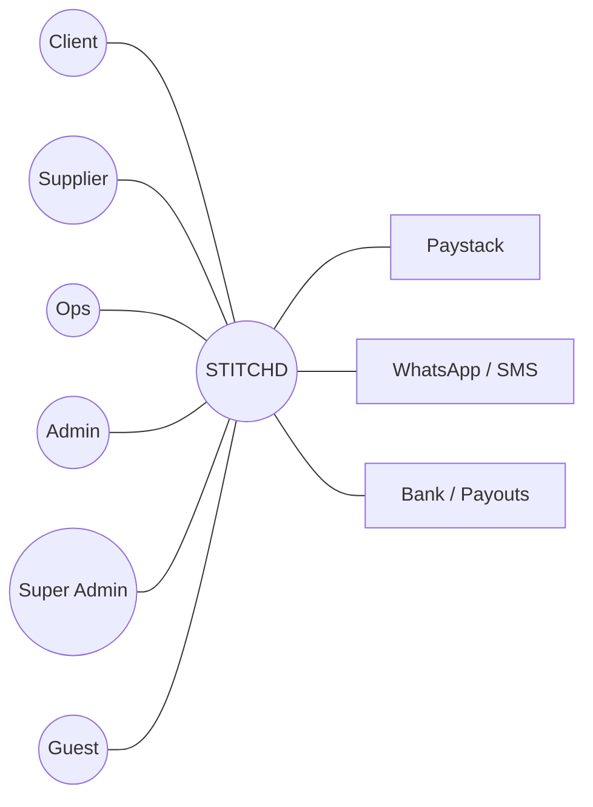

| Actor | Primary goal | Enters at | Exits at |
|---|---|---|---|
| **Client** | Plan/hire, pay, track | Onboarding brief | Event fulfilled + reviewed |
| **Supplier** | Win & fulfil leads, grow, get paid | Sign-up + verification | Payout settled, reviewed |
| **Marketplace Ops** | Keep leads flowing, coordinate | Ops console | Lead assigned/closed |
| **Operator/Admin** | Verify, curate, resolve | Admin console | Supplier live / dispute closed |
| **Super Admin** | Configure & govern | Super-admin console | — (governance) |
| **Guest** | RSVP, see logistics | Signed RSVP link | RSVP submitted |

---

## A4. Functional requirements

Each requirement: **ID · statement · priority (M/S/C = Must/Should/Could) · acceptance criteria**. IDs are grouped by capability and referenced in the traceability matrix (§C1).

### A4.1 Identity & Access (FR-AUTH)
| ID | Requirement | Pri | Acceptance |
|---|---|---|---|
| FR-AUTH-01 | Users authenticate via phone/WhatsApp OTP or email | M | OTP issued & verified; JWT session created |
| FR-AUTH-02 | System assigns a role (client/supplier/coach/ops/admin/super) | M | JWT carries role claim; RLS enforces scope |
| FR-AUTH-03 | Guests act via signed, login-less RSVP links | M | Token valid, single-purpose, expires |
| FR-AUTH-04 | All data access is row-scoped by org/user/role | M | Cross-tenant read denied by RLS test |

### A4.2 Planning — Squad, Budget, RSVP, Seating, Tasks, Timeline (FR-PLAN)
| ID | Requirement | Pri | Acceptance |
|---|---|---|---|
| FR-PLAN-01 | Client onboards via a brief (occasion, priorities, budget, guests, palette, comms) → event created | M | Event persisted; Squad shows baseline readiness |
| FR-PLAN-02 | Squad shows KPI rail (Chemistry, Budget Readiness, Supplier Progress, Guest Readiness, Planning Completion, Upcoming Payments), each drill-through | M | Each tile routes to its lens; no dead ends |
| FR-PLAN-03 | Squad shows secured suppliers as a formation with silhouette empty slots | M | Confirmed suppliers render; gaps name the role to recruit |
| FR-PLAN-04 | Budget provides a cap slider + optimizer protecting priority categories | S | Optimizer resolves within cap; priorities preserved |
| FR-PLAN-05 | Budget shows Spend-by-Category with confirmed-vs-estimated and Gauteng benchmark | M | Categories sorted; benchmark labels shown |
| FR-PLAN-06 | Budget exposes **per-head costs** (catering/cake/bar) linked to headcount | M | Per-head rates shown; totals reflect confirmed heads |
| FR-PLAN-07 | RSVP manages guests (relationship, household), search/filter, bulk confirm/decline/remind | M | Bulk actions update state; caterer hand-off reflects dietary |
| FR-PLAN-08 | Seating supports tables of 10, drag/drop + dropdown seating, add/rename/lock/delete tables | M | Guests seat/unseat; capacity warnings fire |
| FR-PLAN-09 | Seating supports **Add a guest**, which increases headcount | M | New guest appears; headcount recomputed |
| FR-PLAN-10 | Tasks cycle todo→doing→waiting→done; Timeline shows state-derived milestones | S | Task transitions persist; milestones reflect real state |

### A4.3 On-demand Marketplace — Stitch It & Quoting (FR-MKT)
| ID | Requirement | Pri | Acceptance |
|---|---|---|---|
| FR-MKT-01 | Occasion picker (Wedding/Funeral/Birthday/Corporate/Braai) offers a starter bundle | M | Selecting an occasion loads relevant categories + starter |
| FR-MKT-02 | Category tiles list real suppliers with photo, area, rating, availability | M | Tiles filter by category; supplier detail opens |
| FR-MKT-03 | Basket prices subtotal, bundle saving, Stitched+ saving, delivery, total | M | Totals recompute on every change; pure & idempotent |
| FR-MKT-04 | Stitched+ toggle shows live member savings | M | Member pricing applied across basket |
| FR-MKT-05 | Client can produce a printable quote + event checklist | S | Print view renders letterhead; no app chrome |
| FR-MKT-06 | Funeral occasion applies a dignified template + 48h availability filter | S | Funeral flow shows expedited suppliers |

### A4.4 Booking & Tickets (FR-BOOK)
| ID | Requirement | Pri | Acceptance |
|---|---|---|---|
| FR-BOOK-01 | Checkout converts a basket to an order (`ST-BKG`) with a lifecycle | M | Order persisted in Draft→Quoted; ref issued |
| FR-BOOK-02 | A paid order spawns one lead (`ST-LEAD`) per supplier | M | Leads created on PaymentConfirmed |
| FR-BOOK-03 | Order/lead state transitions are auditable end-to-end | M | `/trace` returns contiguous history |
| FR-BOOK-04 | Cancellation applies the refund policy | S | Refund path transitions order to Refunded |

### A4.5 Payments, Subscriptions, Payouts (FR-PAY)
| ID | Requirement | Pri | Acceptance |
|---|---|---|---|
| FR-PAY-01 | Client pays via Paystack hosted checkout (card/Ozow/SnapScan) | M | Checkout URL returned; UI shows pending until webhook |
| FR-PAY-02 | Payment status is truth-from-webhook, HMAC-verified, exactly-once | M | Invalid signature rejected; duplicate event ignored |
| FR-PAY-03 | Funds are held in escrow and released to suppliers on fulfilment | M | Payout only after Fulfilled; split minus 12% fee |
| FR-PAY-04 | One payment splits to N suppliers via subaccounts | M | Split totals reconcile to payment |
| FR-PAY-05 | Stitched+ is a recurring subscription (`ST-SUB`) | M | Subscription active; renewals via webhook |
| FR-PAY-06 | Boost is a one-off charge (`ST-BST`) | M | Charge succeeds → featured activated |
| FR-PAY-07 | All money is integer ZAR cents; nightly reconciliation flags deltas | M | No floats; reconciliation raises `ST-SUP` on mismatch |

### A4.6 Supplier Portal — Listings, Leads, Boost, Verify (FR-SUP)
| ID | Requirement | Pri | Acceptance |
|---|---|---|---|
| FR-SUP-01 | Supplier manages listing, availability, add-ons, media | M | Edits persist; availability drives quotes |
| FR-SUP-02 | Supplier receives leads in real time and accepts/declines | M | New lead appears < 1s; accept/decline transitions lead |
| FR-SUP-03 | Supplier buys Boost and sees live rank + organic-vs-boosted conversion | S | Boost purchase re-ranks; metrics shown |
| FR-SUP-04 | Supplier requests/holds Verification | M | Verified badge on approval |
| FR-SUP-05 | Supplier views earnings, orders, rating, repeat rate, payouts | M | Figures reflect settled payouts |

### A4.7 Ranking & Trust (FR-RANK)
| ID | Requirement | Pri | Acceptance |
|---|---|---|---|
| FR-RANK-01 | Search order = featured, verified, trust, proximity, availability, −responseLag | M | Boost/Verify toggles re-order client grid live |
| FR-RANK-02 | Reviews recompute a supplier Trust score | M | ReviewCreated updates score & ranking |

### A4.8 Messaging (FR-MSG)
| ID | Requirement | Pri | Acceptance |
|---|---|---|---|
| FR-MSG-01 | WhatsApp (SMS fallback) delivers lead alerts, RSVP, receipts, approvals | M | Templated messages sent; delivery logged to ticket ref |
| FR-MSG-02 | Client↔coach chat is state-aware with executable actions | S | Action buttons perform in-app operations |

### A4.9 Change Requests — Headcount → Budget → Approval (FR-CR)
| ID | Requirement | Pri | Acceptance |
|---|---|---|---|
| FR-CR-01 | Increasing headcount past the approved base raises a change request per per-head supplier (`ST-CR`) | M | CR created with delta, per-head, amount |
| FR-CR-02 | Per-head supplier approves/declines the change | M | Approve/decline transitions the CR |
| FR-CR-03 | Approval flows cost into the budget and updates the headcount base | M | Budget committed spend rises; base updated |
| FR-CR-04 | Decline leaves headcount base unchanged and notifies the client | M | No budget change; client notified |

### A4.10 Ops / Admin / Super-Admin (FR-ADMIN)
| ID | Requirement | Pri | Acceptance |
|---|---|---|---|
| FR-ADMIN-01 | Ops sees a live cross-supplier lead board and can assign/reroute | M | Reroute transitions lead; board updates live |
| FR-ADMIN-02 | Admin verifies/features suppliers and resolves disputes/refunds (bounded) | M | Verify/feature toggles; refund within limit |
| FR-ADMIN-03 | Super-admin configures fees/pricing, roles/permissions, feature flags | M | Config changes take effect; audited |
| FR-ADMIN-04 | Super-admin reads the full audit trail | M | Any `ST-*` ref traceable end-to-end |

### A4.11 Traceability & Tickets (FR-TICKET)
| ID | Requirement | Pri | Acceptance |
|---|---|---|---|
| FR-TICKET-01 | Every trackable entity has an `ST-<TYPE>-####` reference | M | Refs unique & typed |
| FR-TICKET-02 | Every state change appends an immutable audit row in-transaction | M | Audit row written atomically with change |
| FR-TICKET-03 | A single ref expands to its full chain (booking→leads→payments→payouts) | M | `/trace` returns the linked chain |

### A4.12 Design & Theming (FR-THEME)
| ID | Requirement | Pri | Acceptance |
|---|---|---|---|
| FR-THEME-01 | 9 palettes incl. **Traditional African**; selection re-skins background + panels + accent | M | Whole surface re-themes on selection |
| FR-THEME-02 | Palette choice rewrites palette-bound supplier briefs (florals, décor, linen, cake) | S | Brief text reflects palette |
| FR-THEME-03 | Reduced-motion and focus-visible are honoured | M | Motion off under prefers-reduced-motion |

---

## A5. Data requirements

### A5.1 Logical data entities
Org, User, RoleAssignment, Supplier, Listing, Addon, Media, Availability, TrustScore, Verification, Boost, Subaccount, Event, Guest, Table, Task, Basket, BasketItem, Order, OrderItem, Lead, ChangeRequest, Payment, Payout, Subscription, Review, Ticket, ActivityLog. (Physical ERD in §B9.)

### A5.2 Data dictionary (key attributes)
| Entity | Key attributes | Notes |
|---|---|---|
| Order | `ref` ST-BKG, `event_id`, `subtotal_cents`, `bundle_saving_cents`, `member_saving_cents`, `delivery_cents`, `total_cents`, `status`, `occasion` | money in **integer ZAR cents** |
| Lead | `ref` ST-LEAD, `order_id`, `supplier_id`, `value_cents`, `status` | one per supplier on a paid order |
| ChangeRequest | `ref` ST-CR, `order_id`, `supplier_id`, `delta_heads`, `per_head_cents`, `amount_cents`, `status` | headcount/scope change |
| Payment | `provider`, `provider_ref`, `amount_cents`, `status`, `idempotency_key` | truth-from-webhook |
| Payout | `ref` ST-PAY, `supplier_id`, `amount_cents`, `status` | escrow release, minus fee |
| Guest | `event_id`, `name`, `relationship`, `household`, `rsvp`, `party`, `table_id?` | RSVP drives headcount |
| ActivityLog | `ref`, `entity_type`, `actor_id`, `actor_role`, `from_state`, `to_state`, `event`, `payload`, `at` | append-only audit spine |

### A5.3 Data retention & privacy
PII minimised; guest contacts retained only for the event lifecycle + statutory period; POPIA data-subject **export & erase** supported (NFR-POPIA). All rows carry `org_id` for RLS isolation.

---

## A6. External interface requirements

### A6.1 User interfaces
Responsive web/PWA; 11 client lenses + supplier portal (3 roles) + admin/super-admin consoles; printable quote/checklist; WCAG-AA contrast; keyboard navigable.

### A6.2 Software interfaces / APIs
- **Payment gateway:** Paystack (Transactions, Split/Subaccounts, Subscriptions, Transfers, Refunds, Webhooks) behind a `PaymentProvider` adapter (§B6).
- **Messaging:** WhatsApp Cloud API + Clickatell SMS fallback.
- **Storage:** Cloudflare R2 (media, documents) via signed URLs.
- **Backend APIs:** auto REST (PostgREST), auto GraphQL (pg_graphql), custom `/api/v1` Edge Functions (§B7).

### A6.3 Communications interfaces
HTTPS/TLS everywhere; WebSocket (Supabase Realtime) for live updates; signed webhooks (HMAC) inbound from Paystack/WhatsApp.

---

## A7. Non-functional requirements

| ID | Category | Requirement |
|---|---|---|
| NFR-PERF-01 | Performance | p95 read < 300ms; checkout init < 800ms; real-time delivery < 1s |
| NFR-SCALE-01 | Scalability | modules extractable to services with no caller rewrite; read replicas + monthly partitioning on leads/orders when needed |
| NFR-AVAIL-01 | Availability | 99.5% target; daily point-in-time backups |
| NFR-SEC-01 | Security | JWT + RLS on every row; service key server-only; HMAC-verified webhooks; signed URLs for private docs; secrets in vault |
| NFR-PAY-01 | Payments integrity | PCI scope minimised (hosted checkout); integer cents; idempotent exactly-once; nightly reconciliation |
| NFR-POPIA-01 | Compliance | RLS isolation; PII minimisation; consent tracking; export/erase; region portable to `af-south-1` |
| NFR-OBS-01 | Observability | structured logs; Sentry errors/traces; event log = business audit; per-ticket SLA dashboards |
| NFR-A11Y-01 | Accessibility | focus-visible; reduced-motion; contrast AA; keyboard paths |
| NFR-COST-01 | Cost | < R800/month pre-revenue on managed/free tiers |
| NFR-RT-01 | Real-time | no batch on the request path; all cross-module effects are event-driven |

---

## A8. Logical data-flow diagrams (DFD)

DFD notation: **rectangles** = external entities, **circles** = processes, **cylinders** = data stores, **arrows** = labelled data flows.

### A8.1 DFD Level 0 — context
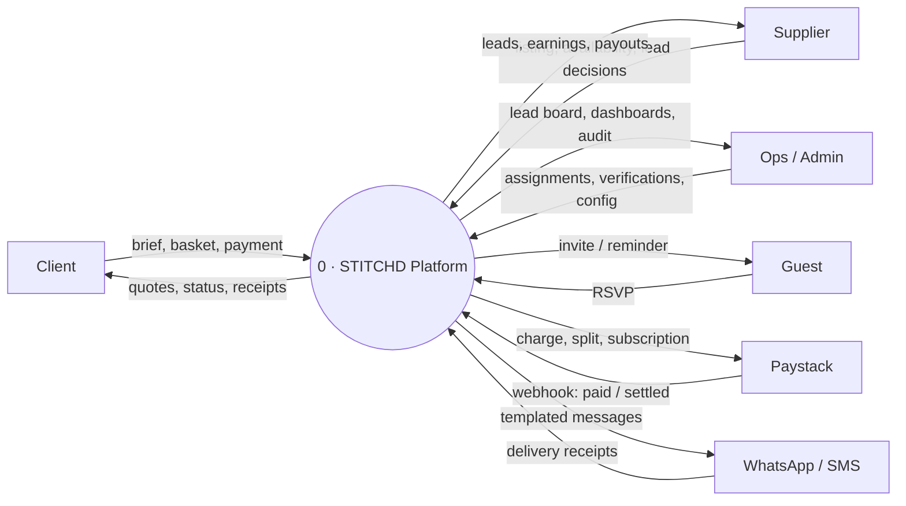

### A8.2 DFD Level 1 — major processes & data stores
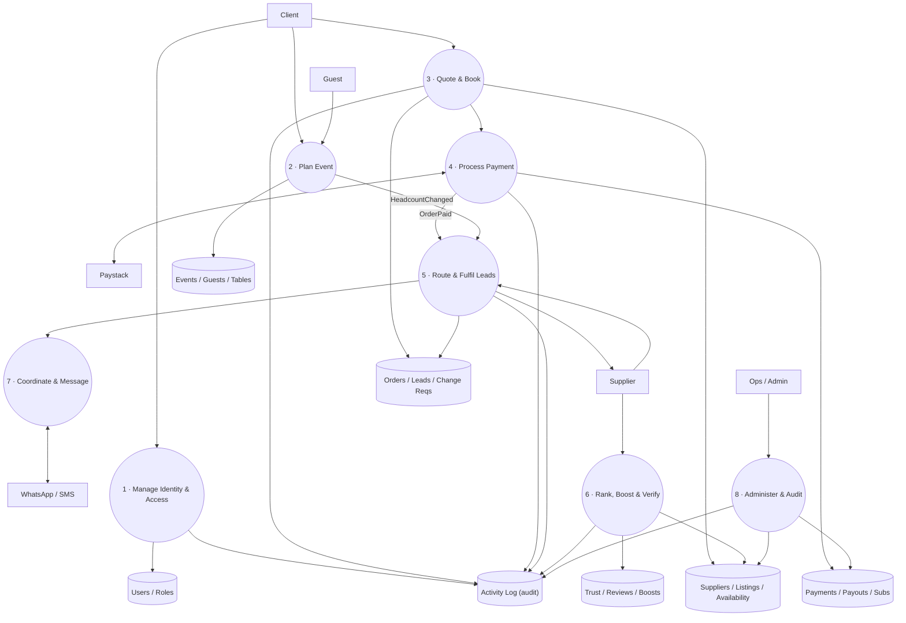

### A8.3 DFD Level 2 — Process 3/4 "Quote → Book → Pay" (the money path)
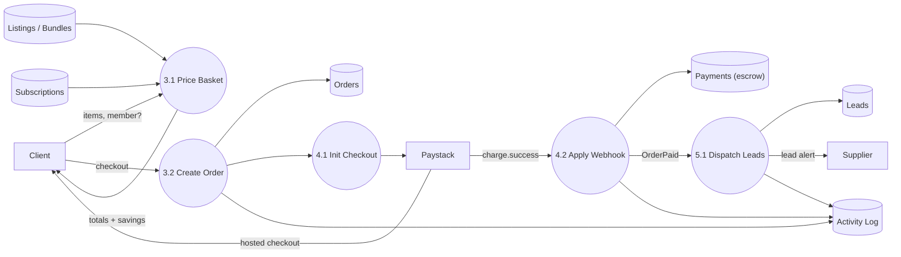

### A8.4 DFD Level 2 — Process "Headcount change → per-head → approval → budget"
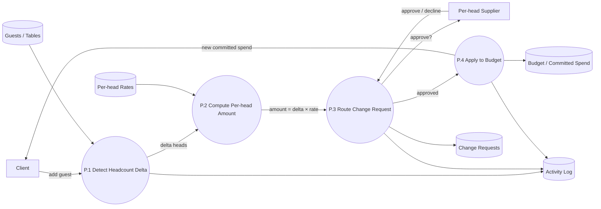

---
---

# PART B — SOLUTION DESIGN SPECIFICATION

## B1. Solution context (C4 — Level 1)

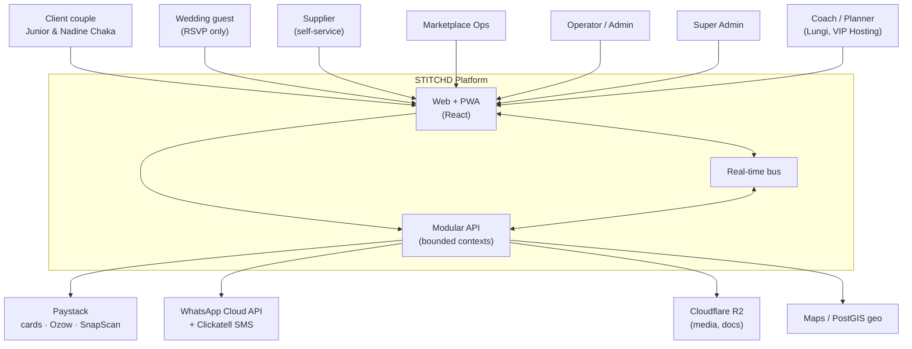

**External systems and why:** Paystack (native ZAR, splits, subscriptions); WhatsApp Cloud API (the default channel in SA) with Clickatell SMS fallback; Cloudflare R2 (no-egress-fee media at SA bandwidth prices); PostGIS for "near me" and delivery radius.

---

## B2. Architecture — modular monolith, service-ready

One deployable, hard module boundaries, everything decoupled behind interfaces + domain events, so any bounded context can be extracted to its own service under load with zero rewrite of callers.

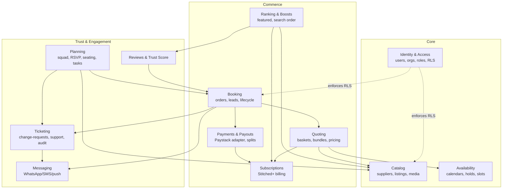

**Event-driven core.** Modules never read each other's tables. They call published interfaces and react to domain events (`OrderPaid`, `LeadAccepted`, `HeadcountChanged`, `BoostActivated`, `ReviewCreated`, `PayoutSettled`). The event log is also the audit spine (§7).

**Stack (chosen for ship-this-week + cheap-now/clean-scale):** React + Vite + Tailwind (PWA) on Cloudflare Pages + R2; **Supabase** (Postgres + Auth + Realtime + Storage + Row-Level Security + PostGIS + pg_boss queue) as the single managed backend; Paystack payments; WhatsApp Cloud API + Clickatell. Est. run cost < **R800/month** pre-revenue. Full rationale in §14.

---

## B3. Actors, personas & access (RBAC)

### 5.1 Actor catalogue

| Actor | Who | Primary goal | Enters at | Exits at |
|---|---|---|---|---|
| **Client** | The couple / event owner (Junior & Nadine Chaka) | Plan & pay for a great event | Onboarding wizard | Event fulfilled + reviewed |
| **Guest** | An invitee | RSVP, see logistics | RSVP deep link (no account) | RSVP submitted |
| **Supplier** | Vendor, self-service | Win & fulfil bookings, grow | Supplier sign-up + verification | Payout settled, reviewed |
| **Coach / Planner** | Assigned human planner (Lungi, VIP Hosting) | Steer the client to 100% | Client assignment | Event handover |
| **Marketplace Ops** | Internal, routes demand | Keep leads flowing, unblock | Ops console | Lead assigned/closed |
| **Operator / Admin** | Internal, manages catalogue | Verify, feature, resolve disputes | Admin console | Supplier live / dispute closed |
| **Super Admin** | Internal, platform owner | Config, pricing, roles, audit | Super-admin console | — (governance) |

### 5.2 Use case diagram — Client

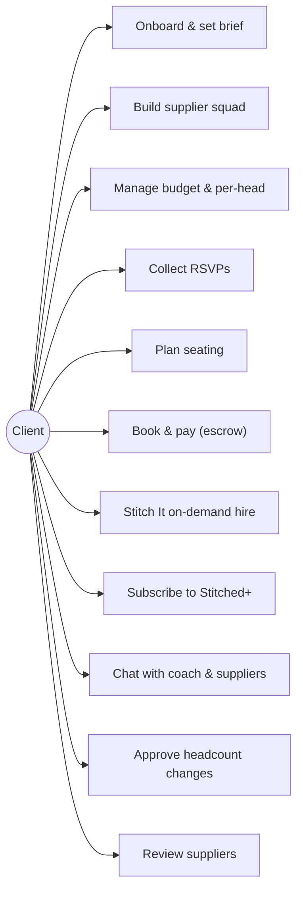

### 5.3 Use case diagram — Supplier

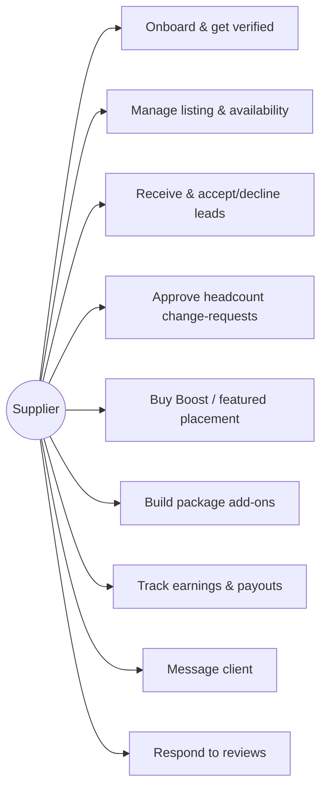

### 5.4 Use case diagram — Ops / Admin / Super Admin

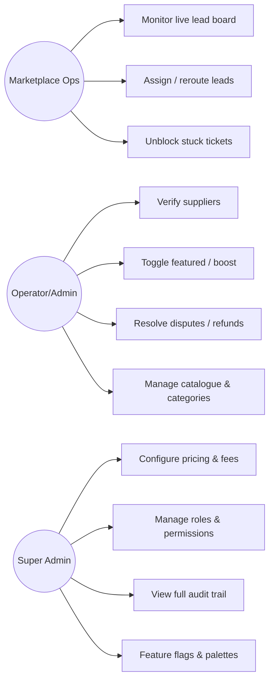

### 5.5 Permission matrix (RBAC)

Enforced at the database via Row-Level Security keyed on `org_id` / `user_id` / `role`. `✓` = allowed, `own` = own records only, `—` = denied.

| Capability | Client | Supplier | Coach | Ops | Admin | Super |
|---|---|---|---|---|---|---|
| View own event / bookings | ✓ | — | assigned | ✓ | ✓ | ✓ |
| Create booking / pay | ✓ | — | on behalf | — | — | — |
| Manage own listing | — | own | — | — | ✓ | ✓ |
| See leads | — | own | assigned | all | all | all |
| Accept/decline lead | — | own | — | reroute | ✓ | ✓ |
| Approve headcount change | — | own (per-head) | — | — | ✓ | ✓ |
| Buy Boost | — | own | — | — | grant | grant |
| Verify supplier | — | — | — | — | ✓ | ✓ |
| Issue refund | — | — | — | request | ✓ | ✓ |
| Configure fees/pricing | — | — | — | — | — | ✓ |
| Manage roles | — | — | — | — | — | ✓ |
| Read audit trail | own | own | assigned | scoped | scoped | ✓ |

---

## B4. The lenses (screen catalogue)

Eleven lenses. Each is: **purpose · primary actor · key features · drill-downs · terminal states (no dead ends)**. Every tile, chart and metric is interactive and leads somewhere.

### 6.1 Squad (dashboard)
- **Purpose:** command centre; wedding health at a glance.
- **Actor:** Client, Coach.
- **Features:** left sticky **KPI rail** — *Chemistry, Budget Readiness, Supplier Progress, Guest Readiness, Planning Completion, Upcoming Payments* — each a drill-through tile (score + status + one insight + one action). Couple "club banner" (FIFA-style). "Your brief" panel. **Starting XI** formation of secured suppliers on a pitch line + **subs bench** + silhouette empty slots naming who to promote. Bundle callout. Stitch It CTA.
- **Drill-downs:** each KPI → its lens; each supplier card → supplier drawer; bundle → apply.
- **Terminal:** every tile routes; no metric is a dead end.

### 6.2 Suppliers
- **Purpose:** browse & secure the squad.
- **Actor:** Client.
- **Features:** FIFA-card grid ordered by service flow (ends **Tailor → Flower Specialist → Décor Supplier**). Card = rating, position code, role, performance score, tier (gold/silver/bronze), palette strip. Drawer = palette proposal → job brief, performance, working WhatsApp link, package deal.
- **Drill-downs:** card → drawer → secure / message / apply bundle.
- **Terminal:** supplier secured or benched; drawer always has a CTA.

### 6.3 Stitch It (on-demand marketplace)
- **Purpose:** hire gear on demand; the "verb."
- **Actor:** Client, walk-in.
- **Features:** hero "Hire it. Stitch it. Done." **Occasion picker** (Wedding/Funeral/Birthday/Corporate/Braai) → one-tap Stitched Starter bundle. Category chips (12), real Joburg suppliers with photo, area, rating, availability. Smart add-ons. Sticky **quote basket** (subtotal, bundle saving, Stitched+ saving, delivery, total). **Stitched+** toggle showing live savings. **Featured** (boosted) sort + **Verified** badges. Platform pulse (today's GMV). Printable **quote** + **checklist**.
- **Drill-downs:** category → filtered grid; item → add + add-ons; basket → book → print.
- **Terminal:** quote booked / printed; empty state has CTA.

### 6.4 Supplier Portal
- **Purpose:** the other side of the marketplace.
- **Actor:** Supplier, Ops, Operator.
- **Features (role switch, leads with self-service):**
  - *Supplier:* listing live/paused, earnings/orders/rating/repeat, **leads inbox** (accept/pass), **upsell rail** in priority order — Stitched+ demand %, **Boost** (live rank + organic-vs-boosted conversion), package add-ons, **Verified** badge.
  - *Marketplace Ops:* live lead board across suppliers, assign/reroute, pipeline GMV, 12% take-rate.
  - *Operator:* manage all suppliers, verify/feature toggles, Boost MRR.
- **The upsell loop:** toggling Boost/Verified here re-orders the client Stitch It grid **live**.
- **Terminal:** lead accepted/passed; supplier verified/featured.

### 6.5 Budget
- **Purpose:** money truth, per-head aware.
- **Actor:** Client, Coach.
- **Features:** cap slider with optimizer (protects priority categories, defers least-needed). **Per-head costs** card (Catering R650, Cake R90, Bar R120 per head) linked to headcount + pending supplier sign-offs. **Spend by category** sorted high→low with confirmed-vs-estimated split, typical Gauteng **benchmark** ranges + status labels, grouped expense tiles, pin toggle.
- **Drill-downs:** category → grouped tiles; pending change → seating; chart tooltips.
- **Terminal:** every line categorised; optimizer always resolves.

### 6.6 RSVP
- **Purpose:** headcount truth.
- **Actor:** Client; Guest (via deep link).
- **Features:** compact guest table (relationship + household columns, search, filter, bulk confirm/decline/remind). Per-row RSVP + WhatsApp/email/tel. Caterer hand-off card (confirmed/worst-case seats, dietary). Reminder history.
- **Drill-downs:** filter chips; bulk actions; message deep links.
- **Terminal:** each guest yes/no/pending; hand-off card always current.

### 6.7 Seating
- **Purpose:** place every guest.
- **Actor:** Client, Coach.
- **Features:** tables of 10, drag-drop + dropdown seat, **add a guest** (ripples to per-head budget + supplier approval), add/rename/delete/lock tables, capacity warnings, undo, save, auto-seat-by-household. Unassigned panel (search + relationship filter). Right table detail (relationship balance, dietary). Seating **intelligence** (household-split, child-without-adult, over-capacity — dismissible).
- **Drill-downs:** table → detail; warning → jump to table; guest → seat.
- **Terminal:** guest seated/unseated; plan saved.

### 6.8 Tasks
- **Purpose:** what's next.
- **Actor:** Client, Coach.
- **Features:** kanban-ish cycle (todo→doing→waiting→done), add, reopen.
- **Terminal:** task done/reopened.

### 6.9 Timeline
- **Purpose:** milestone confidence.
- **Actor:** Client, Coach.
- **Features:** state-derived milestone checks (venue locked, squad secured, RSVPs, final numbers…), each with detail + CTA.
- **Terminal:** milestone done or has an action.

### 6.10 Chat
- **Purpose:** one thread to the coach & suppliers.
- **Actor:** Client, Coach, Supplier.
- **Features:** state-aware coach replies with **executable action buttons**, typing indicator, WhatsApp bridge.
- **Terminal:** message sent; actions execute in-app.

### 6.11 Coach
- **Purpose:** the human in the loop.
- **Actor:** Coach (Lungi); Client sees their coach.
- **Features:** book of weddings, per-couple brief sheet, WhatsApp link, readiness.
- **Terminal:** couple opened / contacted.

---

## B5. Ticket traceability model (the spine)

> The client's core need: *"at any point in time we can follow what a ticket is, and every actor has a start and an end."* STITCHD implements a **single trackable-entity model** with a unified reference scheme and an append-only audit log, so any transaction can be traced start→finish and any actor's involvement is explicit.

### 7.1 Trackable entities & reference scheme

Every trackable "ticket" gets a human-readable reference `ST-<TYPE>-<seq>` and lives in a shared `activity_log`.

| Type | Ref prefix | Owner | Opened by | Closed when |
|---|---|---|---|---|
| **Booking** (client order) | `ST-BKG-####` | Client | checkout | fulfilled + reviewed |
| **Lead** (supplier work item) | `ST-LEAD-####` | Supplier | booking paid | accepted→fulfilled, or rerouted |
| **Change Request** (headcount/scope) | `ST-CR-####` | Supplier (per-head) | client edits headcount/scope | approved/declined |
| **Payout** | `ST-PAY-####` | Finance | fulfilment confirmed | settled to supplier |
| **Verification** | `ST-VER-####` | Admin | supplier submits docs | verified/rejected |
| **Support / Dispute** | `ST-SUP-####` | Ops/Admin | any actor raises | resolved/closed |
| **Boost** | `ST-BST-####` | Supplier | boost purchased | expired/cancelled |
| **Subscription** | `ST-SUB-####` | Client | Stitched+ join | active/cancelled/dunning |

Bookings **link** to their Leads, Change Requests, Payments and Payouts, so a single booking reference expands to the whole chain.

### 7.2 Booking ticket — state machine

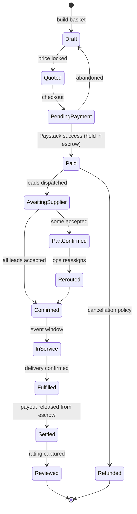

### 7.3 Change-request ticket — state machine (headcount / material scope)

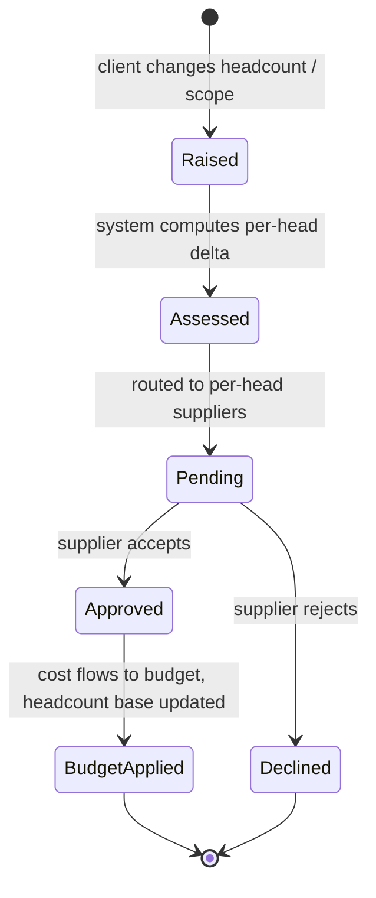

### 7.4 Support / dispute ticket — state machine

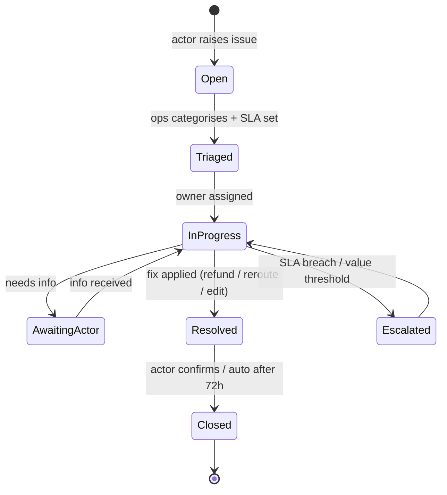

### 7.5 Audit log (traceability guarantee)

Every state transition writes one immutable row. A single query on `ref` returns the full life of any ticket.

| Field | Example |
|---|---|
| `ref` | `ST-BKG-00042` |
| `entity_type` | `booking` |
| `actor_id` / `actor_role` | `u_112` / `client` |
| `from_state` → `to_state` | `Paid` → `AwaitingSupplier` |
| `event` | `LeadsDispatched` |
| `payload` | `{ leads: [ST-LEAD-071, ST-LEAD-072] }` |
| `at` | `2026-08-07T14:04:22+02:00` |

**SLA & ownership:** each ticket type has a target response (leads 2h, change-requests 24h, disputes 4h triage) and an explicit owner at every state — so "who's holding this and since when" is always answerable.

---

## B6. End-to-end workflows (sequence diagrams)

Each workflow shows a clear **start and end for every actor**.

### 8.1 Client onboarding → wedding created
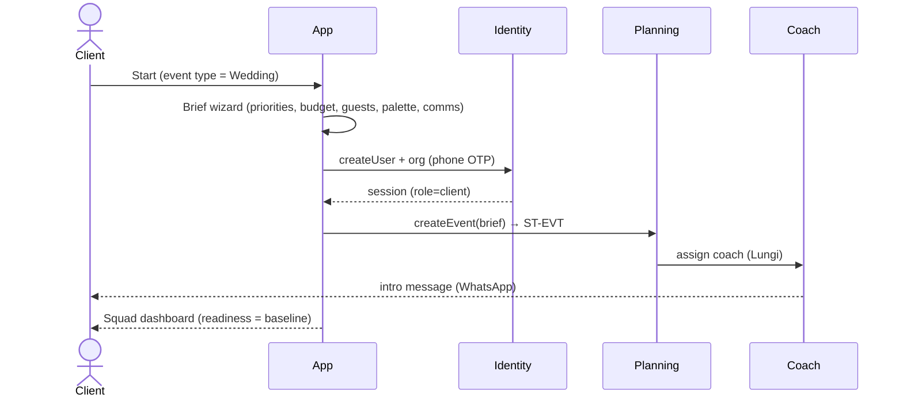

### 8.2 Quote → book → pay (escrow) → supplier lead  — the money path
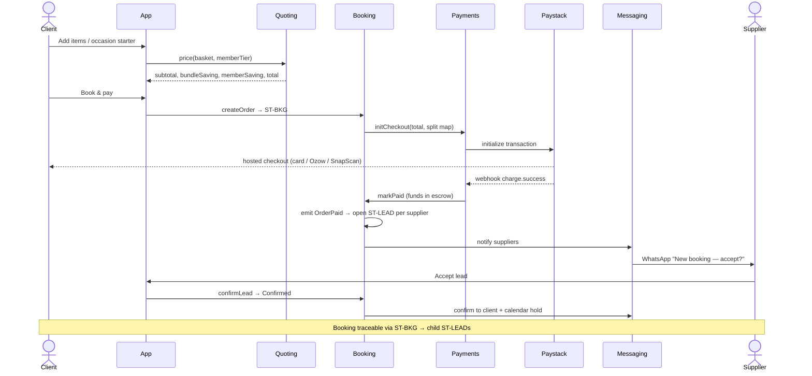

### 8.3 On-demand Stitch It hire (walk-in, fast)
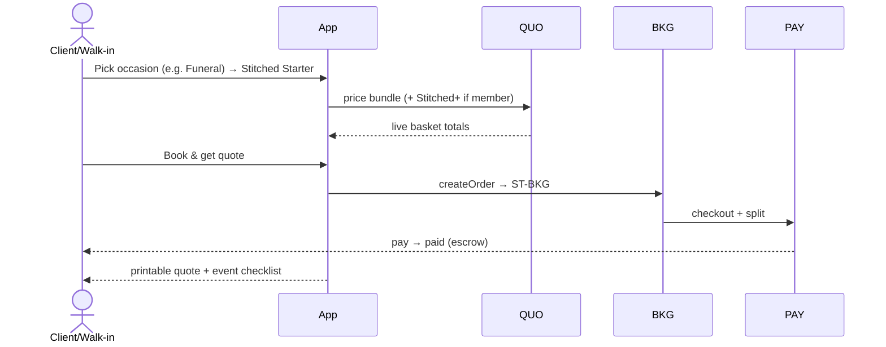

### 8.4 Headcount change → per-head budget → supplier approval
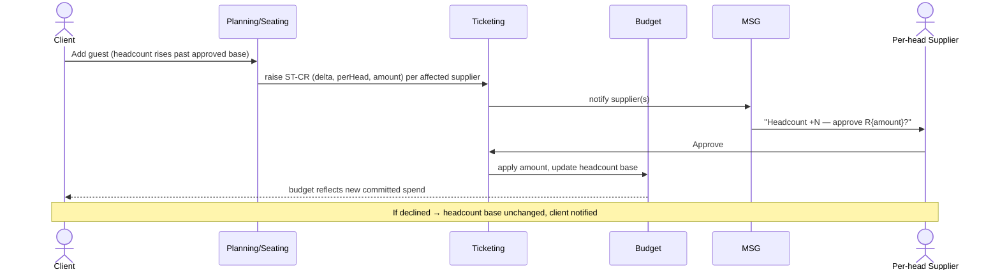

### 8.5 Supplier Boost → ranking → client conversion (upsell loop)
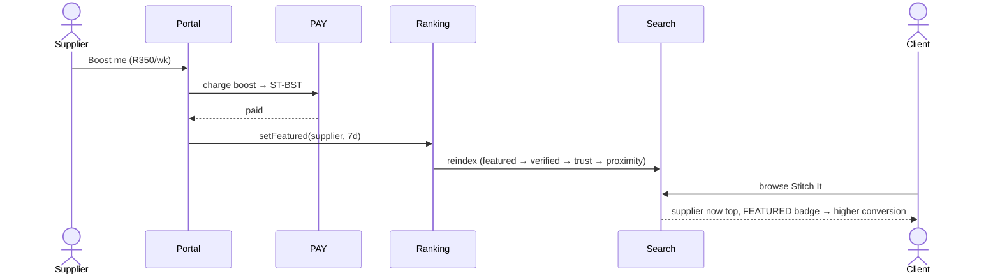

### 8.6 Stitched+ subscription (recurring)
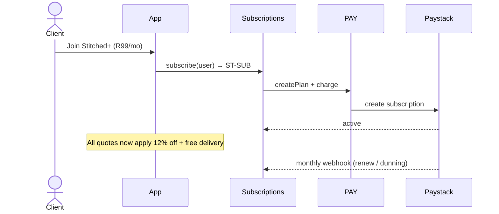

### 8.7 Fulfilment → payout release (escrow settle)
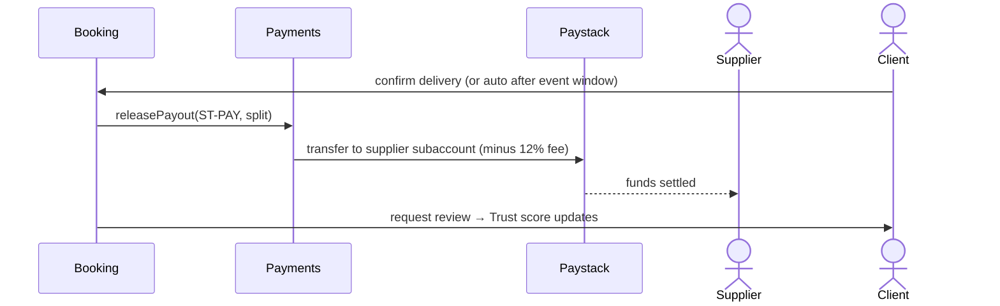

### 8.8 Support / dispute
```mermaid
sequenceDiagram
    actor A as Any actor
    participant App
    participant TKT as Ticketing
    participant Ops
    participant Admin
    A->>App: Raise issue (on a booking/lead)
    App->>TKT: open ST-SUP (linked to ST-BKG)
    TKT->>Ops: triage + SLA
    Ops->>TKT: assign owner
    alt refund needed
        Ops->>Admin: request refund
        Admin->>TKT: approve → Payments refund
    end
    TKT-->>A: resolved + audit trail
```

### 8.9 Funeral journey (intuition: same engine, compressed)
```mermaid
sequenceDiagram
    actor U as Family member
    participant App
    participant QUO
    participant BKG
    participant MSG
    U->>App: Stitch It → occasion = Funeral
    App-->>U: dignified template, rapid starter (marquee, seating, catering, PA)
    U->>QUO: adjust numbers
    U->>BKG: book (expedited availability filter = 48h)
    BKG->>MSG: priority supplier alerts
    Note over U: Same ticketing/traceability; timeline compressed to days
```

---

## B7. Payments integration module (the plug-in) — closing the MVP gap

> The MVP simulates payment. Production needs a real, **real-time**, swappable gateway module. This is the single most important integration to build correctly.

### 9.1 Design goals
- **Adapter pattern** — a `PaymentProvider` interface so Paystack can be swapped/augmented (Ozow, Stripe, Yoco) without touching Booking.
- **Escrow model** — client funds held, released to suppliers only on fulfilment (protects both sides; core to trust).
- **Split payouts** — one client payment fans out to N suppliers minus the 12% platform fee.
- **Idempotent + webhook-driven** — status is truth from Paystack webhooks, never from the client.
- **Real-time status** — payment/lead state pushed to UI over the real-time bus (§10).

### 9.2 Provider interface (contract)
```ts
interface PaymentProvider {
  initCheckout(input: {
    orderRef: string;              // ST-BKG-####
    amountZarCents: number;
    customer: { email?: string; phone: string };
    split: Array<{ supplierSubaccount: string; shareCents: number }>;
    platformFeeCents: number;
    metadata: Record<string,string>;
    idempotencyKey: string;
  }): Promise<{ checkoutUrl: string; providerRef: string }>;

  createSubscription(input: {
    planCode: string; customer: {...}; subRef: string;  // ST-SUB-####
  }): Promise<{ providerRef: string; status: 'active'|'pending' }>;

  chargeBoost(input: {
    supplierId: string; amountZarCents: number; boostRef: string;  // ST-BST-####
  }): Promise<{ providerRef: string; status: 'paid'|'failed' }>;

  releasePayout(input: {
    payoutRef: string;             // ST-PAY-####
    supplierSubaccount: string; amountZarCents: number;
  }): Promise<{ transferRef: string; status: 'queued'|'settled' }>;

  refund(input: { orderRef: string; amountZarCents: number; reason: string })
    : Promise<{ refundRef: string; status: 'processing'|'refunded' }>;

  verifyWebhook(rawBody: string, signature: string): boolean; // HMAC
  parseEvent(rawBody: string): PaymentEvent;
}
```

### 9.3 Paystack mapping
| STITCHD concept | Paystack primitive |
|---|---|
| Client checkout | Transaction Initialize (channels: card, bank, ussd, ozow, snapscan) |
| Split to suppliers | Split Payments / Subaccounts + `transaction_split` |
| Platform fee | `bearer=account`, fixed/percentage split |
| Escrow hold | Delay payout: settle to platform, release via Transfer on fulfilment |
| Supplier payout | Transfers API → supplier subaccount |
| Stitched+ | Plans + Subscriptions |
| Boost | One-off Transaction |
| Refund | Refund API |
| Truth source | Webhooks: `charge.success`, `transfer.success`, `subscription.*`, `refund.processed` |

### 9.4 Webhook handling (idempotent)
```mermaid
sequenceDiagram
    participant PS as Paystack
    participant WH as Webhook endpoint (Edge fn)
    participant PAY as Payments
    participant BKG as Booking
    participant RT as Real-time bus
    PS->>WH: POST event + x-paystack-signature
    WH->>WH: verify HMAC (reject if invalid)
    WH->>WH: dedupe by event id (idempotency)
    WH->>PAY: apply event (state transition)
    PAY->>BKG: markPaid / settlePayout / refund
    BKG->>RT: publish status → client & supplier UIs update live
    WH-->>PS: 200 OK
```

### 9.5 Non-negotiables
- Verify every webhook HMAC; store `provider_event_id` unique to guarantee **exactly-once**.
- Never trust client-reported success; UI shows "pending" until webhook confirms.
- All money in **integer ZAR cents**; no floats.
- Full PCI scope avoided — card data only ever on Paystack-hosted checkout.
- Every payment action writes an `ST-PAY` / `ST-BKG` audit row (§7.5).
- Reconciliation job (pg_boss, nightly): match provider settlements to `payments` ledger; flag deltas as `ST-SUP` tickets.

---

## B8. Real-time module

- **Transport:** Supabase Realtime (Postgres logical replication → websockets). No extra infra.
- **Channels:** `event:{eventId}` (planning), `supplier:{supplierId}` (leads/earnings), `ops:leadboard` (all leads), `booking:{ref}` (payment status).
- **Events pushed:** `LeadCreated`, `LeadAccepted`, `PaymentConfirmed`, `HeadcountChangeRaised`, `ChangeApproved`, `BoostActivated`, `MessagePosted`, `PayoutSettled`.
- **UX effect:** supplier lead inbox, ops lead board, chat, headcount approvals and payment status all update **without refresh**.
- **Fallback:** if socket drops, poll last-event cursor; reconcile.

---

## B9. Messaging module

- **Primary:** WhatsApp Cloud API (Meta) — the SA default channel.
- **Fallback:** Clickatell SMS; email via transactional provider.
- **Templated flows:** lead alert, lead accepted, RSVP invite + reminder, headcount approval request, payment receipt, payout notice, review request.
- **Deep links:** RSVP link (no login), supplier accept link, pay link — each carries a signed token bound to a ticket ref.
- **Compliance:** opt-in tracked; STOP handling; message log linked to the relevant `ST-*` ref for traceability.
---

## B10. Data model (ERD)

Core entities. All money in integer **ZAR cents**. All tables carry `org_id` for RLS, `created_at`, `updated_at`. Append-only `activity_log` is the audit spine (§7.5).

```mermaid
erDiagram
    ORG ||--o{ USER : has
    USER ||--o{ ROLE_ASSIGNMENT : holds
    ORG ||--o| SUPPLIER : "is (if supply-side)"
    SUPPLIER ||--o{ LISTING : offers
    LISTING ||--o{ ADDON : has
    LISTING ||--o{ MEDIA : has
    LISTING ||--o{ AVAILABILITY : has
    SUPPLIER ||--|| TRUST_SCORE : has
    SUPPLIER ||--o{ VERIFICATION : holds
    SUPPLIER ||--o{ BOOST : buys
    SUPPLIER ||--o{ SUBACCOUNT : "payout via"

    USER ||--o{ EVENT : plans
    EVENT ||--o{ GUEST : invites
    EVENT ||--o{ TABLE : seats
    GUEST }o--o| TABLE : "seated at"
    EVENT ||--o{ TASK : tracks
    EVENT ||--o{ BASKET : has
    BASKET ||--o{ BASKET_ITEM : contains
    BASKET_ITEM }o--|| LISTING : references
    BASKET ||--o| ORDER : "checks out to"

    ORDER ||--o{ ORDER_ITEM : contains
    ORDER ||--o{ LEAD : "spawns per supplier"
    ORDER ||--o| PAYMENT : "paid by"
    ORDER ||--o{ CHANGE_REQUEST : "may raise"
    LEAD }o--|| SUPPLIER : "routed to"
    PAYMENT ||--o{ PAYOUT : "splits to"
    PAYOUT }o--|| SUPPLIER : "settles to"

    USER ||--o| SUBSCRIPTION : "may hold Stitched+"
    ORDER ||--o{ REVIEW : yields
    REVIEW }o--|| SUPPLIER : about

    ORDER ||--o{ ACTIVITY_LOG : "audited by (any ref)"

    ORDER {
      uuid id PK
      text ref "ST-BKG-####"
      uuid event_id FK
      int subtotal_cents
      int bundle_saving_cents
      int member_saving_cents
      int delivery_cents
      int total_cents
      text status
      text occasion "wedding|funeral|corporate|braai|birthday"
    }
    LEAD {
      uuid id PK
      text ref "ST-LEAD-####"
      uuid order_id FK
      uuid supplier_id FK
      int value_cents
      text status
    }
    CHANGE_REQUEST {
      uuid id PK
      text ref "ST-CR-####"
      uuid order_id FK
      uuid supplier_id FK
      int delta_heads
      int per_head_cents
      int amount_cents
      text status
    }
    PAYMENT {
      uuid id PK
      text provider "paystack"
      text provider_ref
      int amount_cents
      text status
      text idempotency_key
    }
    ACTIVITY_LOG {
      uuid id PK
      text ref
      text entity_type
      uuid actor_id
      text actor_role
      text from_state
      text to_state
      text event
      jsonb payload
      timestamptz at
    }
```

**Notes for the developer.** `activity_log` is written inside the same transaction as every state change (transactional outbox), so the audit trail can never drift from reality. `ref` sequences are generated per-type from Postgres sequences. `SUBACCOUNT` maps a supplier to their Paystack subaccount for split payouts.

---

## B11. API design — API-first, event-driven, real-time-testable

> **Founder requirement:** the whole system must be **API-driven and testable via API tools** (REST clients, GraphQL/graph explorers, Python). No batch jobs on the request path — everything is **synchronous API + asynchronous events**. This section is the contract a "seasoned tester" uses.

### 13.1 API surfaces (three, all real)
1. **Auto-generated REST** — Supabase **PostgREST** exposes every table/view as REST instantly, guarded by RLS. Great for CRUD + tester exploration.
2. **Auto-generated GraphQL** — Supabase **`pg_graphql`** exposes a `/graphql/v1` endpoint over the same schema/RLS. This is the "**graph tool**" surface: point Apollo Sandbox / GraphiQL / Insomnia at it and traverse the graph (order → leads → supplier → payout) in one query.
3. **Custom domain API (Edge Functions)** — hand-written endpoints for anything with side-effects or money (checkout, webhooks, boost, approvals). REST/JSON, versioned under `/api/v1/*`, documented by an **OpenAPI 3.1** spec (`openapi.yaml`) so Postman/Bruno/Swagger import it directly.

> Rule of thumb: **reads** via PostGREST/GraphQL (RLS-safe), **writes with side-effects** via `/api/v1/*` Edge Functions (validation, events, idempotency).

### 13.2 Auth & tenancy
- **Auth:** Supabase Auth — email OTP + **phone/WhatsApp OTP** (phone-first for SA). JWT bearer on every call.
- **RBAC:** role claims in JWT (`client|supplier|coach|ops|admin|super`); **RLS** policies enforce row scope by `org_id`/`user_id`/`role`.
- **Service role key** (server-only) bypasses RLS for Edge Functions and webhooks — never shipped to the client.
- **Testing identities:** seeded users per role (§16) with a `/api/v1/auth/test-token` endpoint (sandbox only, behind a flag) that mints a scoped JWT so testers can exercise each role without OTP.

### 13.3 Custom domain endpoints (`/api/v1`) — the side-effect API

| Method & path | Purpose | Emits event | Idempotent |
|---|---|---|---|
| `POST /api/v1/events` | Create an event (wedding/funeral…) from brief | `EventCreated` | key |
| `POST /api/v1/baskets/:id/price` | Price a basket (bundles, Stitched+) | — | ✓ pure |
| `POST /api/v1/orders` | Check out a basket → order (Draft→Quoted) | `OrderCreated` | key |
| `POST /api/v1/orders/:ref/checkout` | Init Paystack checkout | `CheckoutInitiated` | key |
| `POST /api/v1/webhooks/paystack` | Payment truth (HMAC-verified) | `PaymentConfirmed`/… | provider id |
| `POST /api/v1/leads/:ref/accept` | Supplier accepts a lead | `LeadAccepted` | key |
| `POST /api/v1/leads/:ref/decline` | Supplier passes | `LeadDeclined` | key |
| `POST /api/v1/leads/:ref/reroute` | Ops reassigns | `LeadRerouted` | key |
| `POST /api/v1/change-requests` | Raise headcount/scope change | `HeadcountChangeRaised` | key |
| `POST /api/v1/change-requests/:ref/approve` | Supplier approves (per-head) | `ChangeApproved` | key |
| `POST /api/v1/change-requests/:ref/decline` | Supplier declines | `ChangeDeclined` | key |
| `POST /api/v1/boosts` | Buy Boost (charges + features) | `BoostActivated` | key |
| `POST /api/v1/verifications/:supplierId` | Admin verify supplier | `SupplierVerified` | key |
| `POST /api/v1/subscriptions` | Join Stitched+ | `SubscriptionActivated` | key |
| `POST /api/v1/payouts/:ref/release` | Release escrow to supplier | `PayoutReleased` | key |
| `POST /api/v1/tickets` | Open support/dispute | `TicketOpened` | key |
| `POST /api/v1/rsvp/:token` | Guest RSVP (no login, signed token) | `RsvpSubmitted` | token |
| `GET  /api/v1/tickets/:ref/trace` | **Full audit trail for any ref** | — | ✓ |

All mutating endpoints accept an `Idempotency-Key` header and return the resulting entity + its new state. Errors use RFC-7807 problem+json with stable `code`s (§Appendix).

### 13.4 Read surface (PostgREST + GraphQL) — examples

REST (RLS-scoped):
```
GET /rest/v1/orders?ref=eq.ST-BKG-00042&select=*,leads(*),payment(*),change_requests(*)
GET /rest/v1/leads?status=eq.new&supplier_id=eq.<uuid>&order=created_at.desc
GET /rest/v1/listings?category=eq.marquee&select=*,supplier(name,area,verified,trust_score)
```

GraphQL (same data, graph traversal — the "graph tool" surface):
```graphql
query TraceBooking($ref: String!) {
  ordersCollection(filter: { ref: { eq: $ref } }) {
    edges { node {
      ref status total_cents occasion
      leadsCollection { edges { node { ref status supplier { name area } } } }
      payment { provider_ref status amount_cents }
      change_requestsCollection { edges { node { ref delta_heads amount_cents status } } }
    } }
  }
}
```

### 13.5 Real-time subscriptions (no polling, event-driven)
```js
// Supplier lead inbox updates live — no refresh, no batch
supabase.channel('supplier:{id}')
  .on('postgres_changes',
      { event: 'INSERT', schema: 'public', table: 'leads', filter: 'supplier_id=eq.{id}' },
      payload => addLeadToInbox(payload.new))
  .subscribe();
```
Channels: `event:{id}`, `supplier:{id}`, `ops:leadboard`, `booking:{ref}`, `ticket:{ref}`.

---

## B12. Event catalog (the async backbone)

Events are the contract between modules and the fuel for real-time. Each is emitted transactionally (outbox) and delivered via Supabase Realtime + pg_boss workers. **No business step waits on a batch.**

| Event | Emitted by | Consumed by | Effect |
|---|---|---|---|
| `EventCreated` | Planning | Catalog, Coach | seed squad slots, assign coach |
| `OrderCreated` | Booking | Payments | prepare checkout |
| `CheckoutInitiated` | Payments | — (client) | return Paystack URL |
| `PaymentConfirmed` | Payments (webhook) | Booking, Messaging, Ledger | mark paid (escrow), dispatch leads, receipt |
| `LeadsDispatched` | Booking | Messaging, Supplier UIs | WhatsApp alerts, inbox rows |
| `LeadAccepted` / `LeadDeclined` | Booking | Booking, Ops, Client UI | progress order; reroute if declined |
| `HeadcountChangeRaised` | Planning | Booking, Supplier UIs | create per-head change tickets |
| `ChangeApproved` / `ChangeDeclined` | Booking | Budget, Client UI | apply cost, update headcount base |
| `BoostActivated` | Ranking | Search/Catalog | re-rank; FEATURED badge live |
| `SupplierVerified` | Trust | Catalog | VERIFIED badge; conversion lift |
| `SubscriptionActivated` | Subscriptions | Quoting | member pricing everywhere |
| `Fulfilled` | Booking | Payments | release payout from escrow |
| `PayoutReleased`/`PayoutSettled` | Payments | Supplier UI, Ledger | earnings + notice |
| `ReviewCreated` | Reviews | Trust, Ranking | recompute Trust score |
| `TicketOpened`/`TicketResolved` | Ticketing | Ops, actor | SLA clock, notify |

Every event also appends to `activity_log`, guaranteeing traceability (§7.5).

---

## B13. API testing harness (for a seasoned tester)

The founder wants to hand a tester something they can **run against the APIs** on day one. Deliverables:

### 15.1 What ships in the repo
- `openapi.yaml` — the full `/api/v1` contract (import into Postman/Bruno/Swagger UI).
- `postman/STITCHD.postman_collection.json` — every endpoint with example bodies + env (`{{baseUrl}}`, `{{jwt}}`).
- `graphql/` — saved GraphQL queries + a link to the hosted **GraphiQL/Apollo Sandbox**.
- `tests/` — a **pytest** suite (below) that walks a full booking lifecycle against the sandbox.
- A seeded **sandbox environment** with test users, Paystack **test keys**, and WhatsApp sandbox numbers.

### 15.2 Python smoke test — full money path (illustrative)
```python
import requests, uuid
BASE = "https://sandbox.stitchd.co.za"

def tok(role):  # sandbox-only helper endpoint mints a scoped JWT
    return requests.post(f"{BASE}/api/v1/auth/test-token", json={"role": role}).json()["jwt"]

client = {"Authorization": f"Bearer {tok('client')}"}
supplier = {"Authorization": f"Bearer {tok('supplier')}"}

# 1) price a basket
basket = requests.post(f"{BASE}/api/v1/baskets/BKT-DEMO/price",
                       json={"items":[{"listing":"h1","qty":1}], "member": False},
                       headers=client).json()
assert basket["total_cents"] > 0

# 2) create order + checkout (idempotent)
key = str(uuid.uuid4())
order = requests.post(f"{BASE}/api/v1/orders",
                      json={"basket":"BKT-DEMO"},
                      headers={**client, "Idempotency-Key": key}).json()
checkout = requests.post(f"{BASE}/api/v1/orders/{order['ref']}/checkout",
                         headers={**client, "Idempotency-Key": key}).json()
assert checkout["checkout_url"].startswith("https://")

# 3) simulate Paystack webhook (sandbox accepts test-signed events)
requests.post(f"{BASE}/api/v1/webhooks/paystack",
              data=open("tests/fixtures/charge_success.json","rb").read(),
              headers={"x-paystack-signature": "<test-hmac>"})

# 4) supplier accepts the spawned lead
leads = requests.get(f"{BASE}/rest/v1/leads?order_id=eq.{order['id']}", headers=supplier).json()
requests.post(f"{BASE}/api/v1/leads/{leads[0]['ref']}/accept", headers=supplier)

# 5) trace the whole ticket end-to-end
trace = requests.get(f"{BASE}/api/v1/tickets/{order['ref']}/trace", headers=client).json()
assert trace[0]["to_state"] == "Draft" and trace[-1]["to_state"] in ("AwaitingSupplier","Confirmed")
print("PASS — full lifecycle traced:", [t["to_state"] for t in trace])
```

### 15.3 Test matrix (contract-level)
| Area | Cases |
|---|---|
| Auth/RBAC | each role can/can't hit each endpoint (RLS + 403s) |
| Idempotency | same `Idempotency-Key` → one effect |
| Payments | webhook HMAC valid/invalid; exactly-once; refund; split totals |
| Change flow | headcount delta → per-head amount → approve → budget applied |
| Ranking | boost → order changes; verify → badge |
| Real-time | subscribe → mutate → event received < 1s |
| Traceability | `/trace` returns contiguous state history |

---

## B14. Design tokens (exact, normative)

```jsonc
{
  "font": { "brand": "Archivo Black", "display": "Fraunces", "ui": "Manrope" },
  "dark": {
    "bg": "#0A0A0E", "panel": "#131319", "panel2": "#1A1A23",
    "ink": "#F2F0EC", "sub": "#9C99AB", "faint": "#5E5B6E",
    "good": "#3DD68C", "warn": "#E9B84C", "bad": "#F0644C", "info": "#5FA8F5"
  },
  "light": {
    "bg": "#F3F1ED", "panel": "#FCFBF8", "panel2": "#ECEAE4",
    "ink": "#171522", "sub": "#5D5A6E", "faint": "#96939F",
    "good": "#178A57", "warn": "#A97614", "bad": "#C24B33", "info": "#2A6BB0"
  },
  "palettes": {
    "midnightViolet":   ["#4B3F8F","#8B7AF5","#221B3A","#E7E3F5","#D4A94E"],
    "blushRomance":     ["#E8C7C8","#C98B95","#8A5A66","#F3E9E4","#D4A94E"],
    "emeraldGold":      ["#1E6E52","#3DA57A","#0E3B2C","#E9E2D0","#D4A94E"],
    "terracottaSunset": ["#B5613C","#E0824F","#7A3B22","#F2E4D6","#C9A24B"],
    "sageGarden":       ["#7A8A5A","#A7B588","#4E5B3A","#EDEFE3","#C9A24B"],
    "royalNavy":        ["#25365A","#43618E","#141E33","#E4E8EF","#D4A94E"],
    "dustyRose":        ["#C48B94","#E3B7BE","#8A5560","#F4E9EB","#B99B54"],
    "goldenHour":       ["#D99B4C","#F0C378","#9A6522","#F6ECD9","#8A6A2A"],
    "traditionalAfrican":["#C1272D","#E8A020","#1E7A3C","#F3E7CE","#111111"]
  },
  "motion": { "press": "0.12s", "rise": "0.5s cubic-bezier(.16,1,.3,1)", "reducedMotion": "honoured" },
  "radius": { "card": 16, "chip": 999 }
}
```
Palette selection sets `accent`, `gold`, and the **background wash** (`deep` in dark / `cream` in light) and rewrites palette-bound supplier briefs (florals, décor, linen, cake, tailoring).

---

## B15. Non-functional requirements

| Area | Requirement |
|---|---|
| **Performance** | p95 API < 300ms (reads), < 800ms (checkout init); real-time delivery < 1s |
| **Availability** | 99.5% pitch target; managed tiers; daily PITR backups |
| **Security** | JWT + RLS on every row; service key server-only; HMAC-verified webhooks; signed URLs for private docs; secrets in vault; least-privilege roles |
| **Payments** | PCI scope minimised (hosted checkout); money in integer cents; idempotent + exactly-once; reconciliation nightly |
| **POPIA** | RLS isolation; PII minimisation; consent tracking; data-subject **export & erase** jobs; processor agreements; region portable to `af-south-1` |
| **Observability** | structured logs, Sentry errors/traces, event log = business audit; per-ticket SLA dashboards |
| **Accessibility** | focus-visible, reduced-motion, contrast AA, keyboard paths |
| **Cost** | < R800/month pre-revenue on free/managed tiers |

---

## B16. Delivery plan & build-ticket management

### 18.1 How build tickets are managed
Work is tracked as **Epics → Stories → Tasks** in the tracker (Linear/Jira), one epic per bounded context. Definition of Done for every story: code + tests (unit + API contract) + RLS policy + OpenAPI updated + event emitted + audit row + demo on the sandbox. Branch per story, PR review, CI runs the pytest API suite (§15) before merge. Trace IDs in the app (`ST-*`) mirror ticket refs so a support issue links to the exact order.

### 18.2 This-week build order (pitch build)
| Day | Deliverable | Modules |
|---|---|---|
| Mon | Repo, Supabase, Auth (phone OTP), schema + RLS, `ST-*` sequences, OpenAPI skeleton | Identity, Catalog |
| Tue | Catalog + Listings + media (R2); port MVP UI to live REST/GraphQL | Catalog, Availability |
| Wed | Quoting (bundles, Stitched+) + Order + **Paystack checkout** (test) + webhook | Quoting, Booking, Payments |
| Thu | Supplier Portal live: leads (Realtime), accept/decline, **Boost + Verify → ranking**; change-request/approval flow | Booking, Ranking, Trust, Ticketing |
| Fri | WhatsApp lead alerts + RSVP; Stitched+ subscribe; seed Junior & Nadine + 20 Joburg suppliers; deploy sandbox + Postman/pytest | Messaging, Subs |
| Wknd | Hardening: RLS matrix, webhook exactly-once, printable docs, Sentry, dispute/refund | All |

**Pitch "done":** a client builds a Stitch It quote, subscribes to Stitched+, pays via Paystack (test), a real supplier gets a WhatsApp lead and accepts it in the portal, Boost/Verify visibly re-rank the client grid, a headcount change routes for per-head approval and flows to budget — and every step is traceable via `/trace`, runnable from Postman/pytest.

---

## B17. Seed / dummy data — the flagship demo

### 19.1 The couple
> **Junior & Nadine Chaka** — Black South African couple. Wedding **14 Nov 2026**, **Oakfield Farm, Muldersdrift**, **140 guests**, budget **R400k**, palette **Traditional African** (switchable), coach **Lungi Dlodlo (VIP Hosting)**. *Real couple photos supplied by founder; until then a placeholder Black-representation portrait is used and clearly swappable via one media reference.*

### 19.2 Suppliers (Joburg, simulated)
Squad: VIP Hosting (planner), Oakfield Farm (venue, multi-service bundle), Memories by TK (photo), Taste Affair (catering, per-head), Bloom Room (flowers), Vibe Creators (DJ), Sugar & Spice (cake), Stitch & Cut Atelier (tailor), Décor Elegance, Shade & Shine Marquees, Glam Squad by Zanele, VIP Chauffeurs.
Stitch It: Stretch & Shade (Fourways), BassLine JHB (Soweto), Braai Brothers (Randburg), Bounce Town (Boksburg), Tap & Pour (Sandton), Loo Deluxe (Kempton Park), Bean Machine (Parktown), Chill Trailer Co (Edenvale), Snap Shack (Rosebank) …

### 19.3 Seed tickets (so `/trace` demos immediately)
- `ST-BKG-00042` — Chaka wedding catering+DJ+décor bundle, `AwaitingSupplier`.
- `ST-CR-00007` — +6 guests → Taste Affair per-head change, `Pending`.
- `ST-BST-00003` — Snap Shack boost, `Active`.
- `ST-SUB-00011` — Chaka Stitched+, `Active`.

### 19.4 Seed users (one per role, for API tests)
`client@demo`, `supplier@demo`, `coach@demo`, `ops@demo`, `admin@demo`, `super@demo` — each mintable via the sandbox test-token endpoint (§13.2).

---

## B18. Roadmap (post-pitch)

| Phase | Focus |
|---|---|
| **P1 (now)** | Weddings live; on-demand + funeral visible; payments, portal, real-time, traceability |
| **P1.5** | Funeral fast-track templates; corporate presets; supplier mobile PWA polish |
| **P2** | Typesense search; ML ranking; multi-city; loyalty; insurance/finance add-ons |
| **P3** | `af-south-1` residency; KAZI Trust-Passport interop; AI concierge |

---

## Appendix A — Error codes (problem+json)
`AUTH_401`, `RBAC_403`, `IDEMPOTENCY_CONFLICT_409`, `PAYMENT_WEBHOOK_INVALID_400`, `LEAD_ALREADY_RESOLVED_409`, `CHANGE_ALREADY_RESOLVED_409`, `INSUFFICIENT_AVAILABILITY_409`, `VALIDATION_422`, `RATE_LIMIT_429`.

## Appendix B — Key environment variables
`SUPABASE_URL`, `SUPABASE_ANON_KEY`, `SUPABASE_SERVICE_ROLE_KEY`, `PAYSTACK_SECRET_KEY`, `PAYSTACK_PUBLIC_KEY`, `PAYSTACK_WEBHOOK_SECRET`, `WHATSAPP_TOKEN`, `WHATSAPP_PHONE_ID`, `CLICKATELL_API_KEY`, `R2_ACCESS_KEY`, `R2_SECRET`, `JWT_SECRET`, `SANDBOX_TEST_TOKENS=on|off`.

## Appendix C — Glossary
**Lens** = a client screen/mode. **Ticket** = any trackable entity (`ST-*`). **Squad** = the set of suppliers for an event. **Stitch It** = on-demand marketplace. **Stitched+** = client subscription. **Boost** = paid featured placement. **Trust score** = supplier reputation index feeding ranking.

---

*End of specification. Everything in the reference MVP (`stitchd-v9`) maps to a module, an API, an event and a ticket type here — nothing shown in the demo is throwaway, and every actor has a defined start and end for every process.*

---
---

# PART C — TRACEABILITY

## C1. Requirements → design → API → event → test matrix

Every functional requirement traces to the design that realises it, the API/event that exposes it, the ticket it touches, and the test that proves it. (Design refs point to Part B sections; test IDs to the harness in §B15 / §C2.)

| FR | Realised by (design) | API / surface | Event(s) | Ticket | Test |
|---|---|---|---|---|---|
| FR-AUTH-01/02 | Identity & Access; RLS | Supabase Auth; JWT | — | — | T-AUTH |
| FR-AUTH-03 | Signed RSVP token | `POST /api/v1/rsvp/:token` | `RsvpSubmitted` | — | T-RSVP |
| FR-AUTH-04 | RLS policies (§B1/§B7) | PostgREST/GraphQL under RLS | — | — | T-RBAC |
| FR-PLAN-01 | Planning module; onboarding flow (§B5.1) | `POST /api/v1/events` | `EventCreated` | ST-EVT | T-PLAN |
| FR-PLAN-02/03 | Squad lens (§B4) | REST reads | — | — | T-PLAN |
| FR-PLAN-06 | Budget per-head (§B4.5) | REST reads | — | — | T-BUDGET |
| FR-PLAN-08/09 | Seating (§B4.7) | REST writes | `HeadcountChangeRaised` | ST-CR | T-SEAT |
| FR-MKT-03 | Quoting (§B4.3) | `POST /api/v1/baskets/:id/price` | — | — | T-QUOTE |
| FR-MKT-04 | Subscriptions pricing | REST reads | `SubscriptionActivated` | ST-SUB | T-MEMBER |
| FR-BOOK-01/02 | Booking lifecycle (§B7.2) | `POST /api/v1/orders` | `OrderCreated`, `LeadsDispatched` | ST-BKG, ST-LEAD | T-BOOK |
| FR-BOOK-03 | Audit spine (§B7.5) | `GET /api/v1/tickets/:ref/trace` | — | all | T-TRACE |
| FR-PAY-01/02 | Payments module + webhook (§B9) | `…/checkout`, `…/webhooks/paystack` | `CheckoutInitiated`, `PaymentConfirmed` | ST-BKG | T-PAY, T-WEBHOOK |
| FR-PAY-03/04 | Escrow + split (§B9.3) | `POST /api/v1/payouts/:ref/release` | `Fulfilled`, `PayoutReleased` | ST-PAY | T-PAYOUT |
| FR-PAY-05 | Subscriptions (§B8.6) | `POST /api/v1/subscriptions` | `SubscriptionActivated` | ST-SUB | T-SUB |
| FR-PAY-06 | Boost billing | `POST /api/v1/boosts` | `BoostActivated` | ST-BST | T-BOOST |
| FR-SUP-02 | Booking + Real-time (§B10) | `…/leads/:ref/accept` | `LeadAccepted` | ST-LEAD | T-LEAD, T-RT |
| FR-SUP-04 | Trust/Verification | `POST /api/v1/verifications/:id` | `SupplierVerified` | ST-VER | T-VERIFY |
| FR-RANK-01 | Ranking & Boosts (§B8.5) | Search reads | `BoostActivated`, `SupplierVerified` | ST-BST | T-RANK |
| FR-RANK-02 | Reviews & Trust | REST writes | `ReviewCreated` | — | T-TRUST |
| FR-MSG-01 | Messaging module (§B11) | Edge fn → WhatsApp | (all notify) | linked ref | T-MSG |
| FR-CR-01/02/03 | Change-request flow (§B7.3, §B8.4) | `…/change-requests[/approve]` | `HeadcountChangeRaised`, `ChangeApproved` | ST-CR | T-CHANGE |
| FR-ADMIN-01 | Ops lead board (§B6.4) | REST + Realtime | `LeadRerouted` | ST-LEAD | T-OPS |
| FR-ADMIN-02 | Admin console | `…/verifications`, refund | `SupplierVerified` | ST-VER, ST-SUP | T-ADMIN |
| FR-ADMIN-03/04 | Super-admin + audit (§B7.5) | config API; `/trace` | — | all | T-SUPER, T-TRACE |
| FR-TICKET-01/02/03 | Ticket spine + outbox (§B7) | `/trace` | (all) | all | T-TRACE |
| FR-THEME-01/02 | Design tokens (§B16) | client | — | — | T-THEME |

## C2. Test catalogue (contract-level)
`T-AUTH, T-RBAC, T-RSVP, T-PLAN, T-BUDGET, T-SEAT, T-QUOTE, T-MEMBER, T-BOOK, T-TRACE, T-PAY, T-WEBHOOK, T-PAYOUT, T-SUB, T-BOOST, T-LEAD, T-RT, T-VERIFY, T-RANK, T-TRUST, T-MSG, T-CHANGE, T-OPS, T-ADMIN, T-SUPER, T-THEME` — each runnable from the pytest suite / Postman collection against the seeded sandbox (§B15). Every test asserts state transitions and, where money is involved, exactly-once + split reconciliation.

## C3. Definition of Done (per requirement)
A requirement is *done* when: code merged; unit + API-contract test green in CI; RLS policy in place; OpenAPI updated; the emitting event and audit row verified; and a sandbox demo exists. App trace refs (`ST-*`) mirror ticket refs so any support issue links to the exact order.

---

*End of combined SRS + SDS. Part A defines every requirement with an owning actor and a start/end; Part A §A8 shows the logical data flows; Part B shows the solution that realises them; Part C proves each requirement is designed, exposed via API/event, ticketed and tested. Nothing in the MVP `stitchd-v9` is throwaway — it all maps here.*
