# STITCHD — Solution Design Specification
### Events, stitched together — Marketplace + Planning + Coordination platform
**For:** Muzy (Lead Developer) · **Prepared by:** Solution Design · **Status:** Build-ready (pitch build, Q3 2026)
**Version:** 1.0 · **Region:** South Africa (Johannesburg-first) · **Compliance:** POPIA

> **How to read this document.** §1–§4 give the shape and scope. §5 is the actor/RBAC model. §6 catalogues every screen ("lens"). §7 is the **ticket traceability model** — the spine of the system. §8 is every end‑to‑end workflow as a sequence diagram. §9–§11 are the integration modules you'll build (Payments, Real‑time, Messaging) — these are the "plug‑ins" that close the gaps in the MVP. §12 is the data model. §13 is the design system (exact tokens). §14 is non‑functional + security. §15 is the delivery backlog and how build tickets are managed. §16 is the seed/dummy data (Junior & Nadine Chaka). Everything an actor can do has a defined **start and end state**, and every transaction is traceable end‑to‑end via a single reference scheme (§7).

---

## 1. Executive summary

STITCHD is **two customer journeys running on one vetted supplier network**, plus the supplier-side tooling that makes the network self-sustaining:

1. **Plan** — episodic, high-value event planning (weddings first; funerals and corporate share the engine). A couple assembles a "squad" of suppliers, drives the event to 100% readiness, and pays through the platform.
2. **Stitch It** — on-demand hire. Anyone needing event gear this weekend (birthday, funeral, braai, corporate) picks, prices and books in minutes. This is the **daily-habit, recurring-revenue** engine.
3. **Supplier Portal** — self-service listings, a real-time lead inbox, earnings/payouts, and the paid growth levers (Boost, Verification).

**The moat** is the vetted supplier network and its portable **Trust score**. Both journeys monetise the same network. The strategic north star: *stitch* becomes a verb — "just stitch it."

**Revenue lines (priority order, already modelled in the MVP):**
1. **Stitched+ subscription** — client saves 12% + free delivery for R99/mo (recurring, sticky).
2. **Supplier Boost** — featured placement (~R350/wk), supplier-paid ranking.
3. **Bundle / package upsell** — bigger baskets at checkout.
4. **Verification badges** — free to supplier, lifts conversion, feeds Trust.
5. **Platform take-rate** — 12% service fee on GMV.

**Market context (from validation).** Venue owners confirmed demand for a bookable events marketplace + coordination engine; suppliers want to sell more than venue hire (accommodation, catering, décor, bar, add-ons) and fill unused dates. Weddings are the beachhead vertical because they are high-value, planning-intensive, and referral-rich. Funerals and on-demand share the same supplier graph and are deliberately visible from day one so the "verb" positioning is credible.

---

## 2. Scope

### 2.1 In scope (pitch build)
- Full **wedding** planning journey (all 11 lenses below), instantiated with a real dummy wedding (Junior & Nadine Chaka).
- **On-demand Stitch It** marketplace with occasion presets (Wedding, Funeral, Birthday, Corporate, Braai) — funeral and on-demand are first-class, visible, accessible.
- **Supplier Portal** with three role-views (self-service supplier, marketplace ops, operator/admin).
- **Payments**: Paystack integration module (checkout, split payouts, subscription, boost billing) — real-time via webhooks.
- **Real-time**: live lead board, chat, notifications, headcount-change approvals.
- **Messaging**: WhatsApp Cloud API + SMS fallback for leads, RSVP, confirmations.
- **Ticket traceability** across booking, lead, change-request, payout, verification and support.
- **Design system** with 9 palettes incl. **Traditional African**, and full re-skinning (colours + background) on theme change.

### 2.2 In scope — "intuition" (visible, lightly wired for pitch)
- **Funeral** journey: compressed timeline, dignified copy, rapid sourcing preset. Same engine, different template.
- **Corporate / Braai** occasion presets in Stitch It.

### 2.3 Out of scope (post-pitch, noted in roadmap §17)
- Native mobile apps (PWA covers pitch).
- Multi-currency / cross-border.
- Advanced ML ranking (rules-based ranking ships first).
- Full accounting/ERP integration (export only).
- KAZI Trust-Passport cross-product integration (separate product).

---

## 3. Solution context (C4 — Level 1)

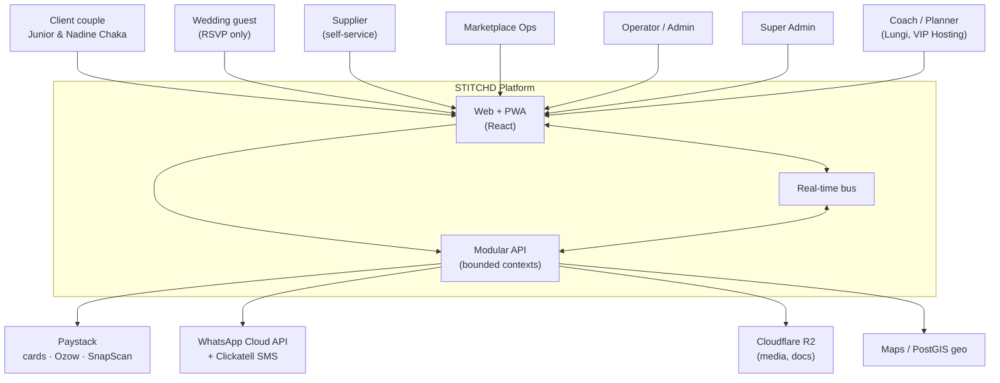

**External systems and why:** Paystack (native ZAR, splits, subscriptions); WhatsApp Cloud API (the default channel in SA) with Clickatell SMS fallback; Cloudflare R2 (no-egress-fee media at SA bandwidth prices); PostGIS for "near me" and delivery radius.

---

## 4. Architecture — modular monolith, service-ready

One deployable, hard module boundaries, everything decoupled behind interfaces + domain events, so any bounded context can be extracted to its own service under load with zero rewrite of callers.

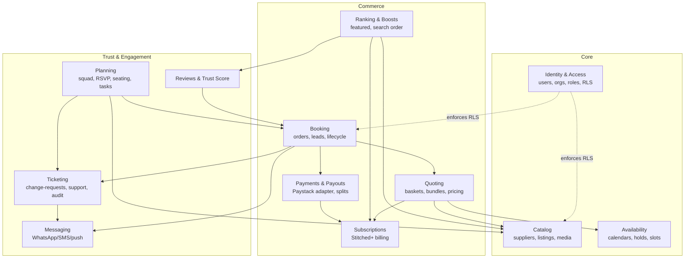

**Event-driven core.** Modules never read each other's tables. They call published interfaces and react to domain events (`OrderPaid`, `LeadAccepted`, `HeadcountChanged`, `BoostActivated`, `ReviewCreated`, `PayoutSettled`). The event log is also the audit spine (§7).

**Stack (chosen for ship-this-week + cheap-now/clean-scale):** React + Vite + Tailwind (PWA) on Cloudflare Pages + R2; **Supabase** (Postgres + Auth + Realtime + Storage + Row-Level Security + PostGIS + pg_boss queue) as the single managed backend; Paystack payments; WhatsApp Cloud API + Clickatell. Est. run cost < **R800/month** pre-revenue. Full rationale in §14.

---

## 5. Actors, personas & access (RBAC)

### 5.1 Actor catalogue

| Actor | Who | Primary goal | Enters at | Exits at |
|---|---|---|---|---|
| **Client** | The couple / event owner (Junior & Nadine Chaka) | Plan & pay for a great event | Onboarding wizard | Event fulfilled + reviewed |
| **Guest** | An invitee | RSVP, see logistics | RSVP deep link (no account) | RSVP submitted |
| **Supplier** | Vendor, self-service | Win & fulfil bookings, grow | Supplier sign-up + verification | Payout settled, reviewed |
| **Coach / Planner** | Assigned human planner (Lungi, VIP Hosting) | Steer the client to 100% | Client assignment | Event handover |
| **Marketplace Ops** | Internal, routes demand | Keep leads flowing, unblock | Ops console | Lead assigned/closed |
| **Operator / Admin** | Internal, manages catalogue | Verify, feature, resolve disputes | Admin console | Supplier live / dispute closed |
| **Super Admin** | Internal, platform owner | Config, pricing, roles, audit | Super-admin console | — (governance) |

### 5.2 Use case diagram — Client

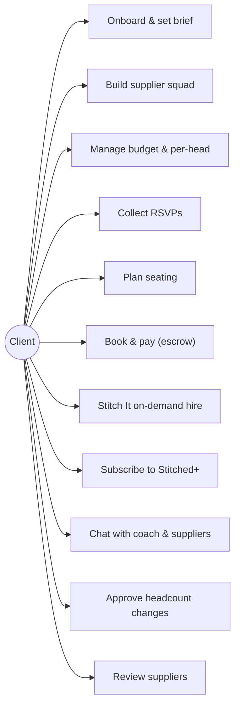

### 5.3 Use case diagram — Supplier

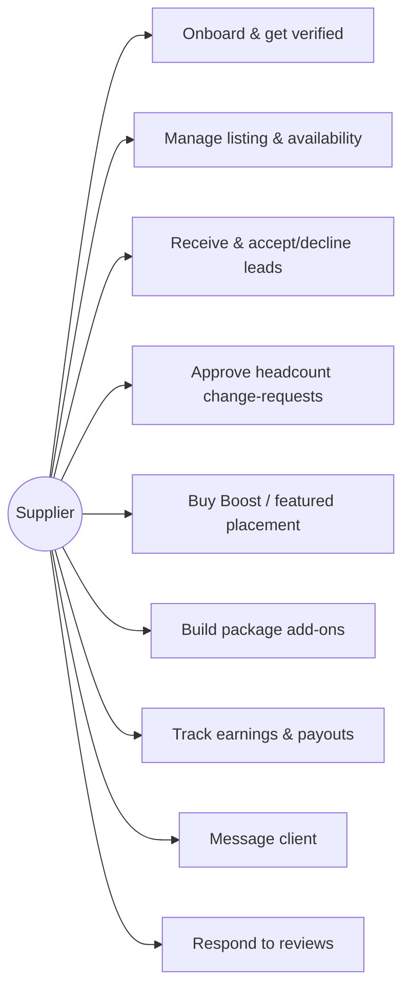

### 5.4 Use case diagram — Ops / Admin / Super Admin

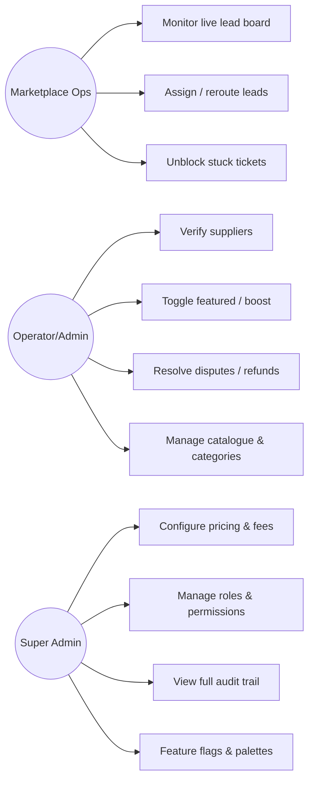

### 5.5 Permission matrix (RBAC)

Enforced at the database via Row-Level Security keyed on `org_id` / `user_id` / `role`. `✓` = allowed, `own` = own records only, `—` = denied.

| Capability | Client | Supplier | Coach | Ops | Admin | Super |
|---|---|---|---|---|---|---|
| View own event / bookings | ✓ | — | assigned | ✓ | ✓ | ✓ |
| Create booking / pay | ✓ | — | on behalf | — | — | — |
| Manage own listing | — | own | — | — | ✓ | ✓ |
| See leads | — | own | assigned | all | all | all |
| Accept/decline lead | — | own | — | reroute | ✓ | ✓ |
| Approve headcount change | — | own (per-head) | — | — | ✓ | ✓ |
| Buy Boost | — | own | — | — | grant | grant |
| Verify supplier | — | — | — | — | ✓ | ✓ |
| Issue refund | — | — | — | request | ✓ | ✓ |
| Configure fees/pricing | — | — | — | — | — | ✓ |
| Manage roles | — | — | — | — | — | ✓ |
| Read audit trail | own | own | assigned | scoped | scoped | ✓ |

---

## 6. The lenses (screen catalogue)

Eleven lenses. Each is: **purpose · primary actor · key features · drill-downs · terminal states (no dead ends)**. Every tile, chart and metric is interactive and leads somewhere.

### 6.1 Squad (dashboard)
- **Purpose:** command centre; wedding health at a glance.
- **Actor:** Client, Coach.
- **Features:** left sticky **KPI rail** — *Chemistry, Budget Readiness, Supplier Progress, Guest Readiness, Planning Completion, Upcoming Payments* — each a drill-through tile (score + status + one insight + one action). Couple "club banner" (FIFA-style). "Your brief" panel. **Starting XI** formation of secured suppliers on a pitch line + **subs bench** + silhouette empty slots naming who to promote. Bundle callout. Stitch It CTA.
- **Drill-downs:** each KPI → its lens; each supplier card → supplier drawer; bundle → apply.
- **Terminal:** every tile routes; no metric is a dead end.

### 6.2 Suppliers
- **Purpose:** browse & secure the squad.
- **Actor:** Client.
- **Features:** FIFA-card grid ordered by service flow (ends **Tailor → Flower Specialist → Décor Supplier**). Card = rating, position code, role, performance score, tier (gold/silver/bronze), palette strip. Drawer = palette proposal → job brief, performance, working WhatsApp link, package deal.
- **Drill-downs:** card → drawer → secure / message / apply bundle.
- **Terminal:** supplier secured or benched; drawer always has a CTA.

### 6.3 Stitch It (on-demand marketplace)
- **Purpose:** hire gear on demand; the "verb."
- **Actor:** Client, walk-in.
- **Features:** hero "Hire it. Stitch it. Done." **Occasion picker** (Wedding/Funeral/Birthday/Corporate/Braai) → one-tap Stitched Starter bundle. Category chips (12), real Joburg suppliers with photo, area, rating, availability. Smart add-ons. Sticky **quote basket** (subtotal, bundle saving, Stitched+ saving, delivery, total). **Stitched+** toggle showing live savings. **Featured** (boosted) sort + **Verified** badges. Platform pulse (today's GMV). Printable **quote** + **checklist**.
- **Drill-downs:** category → filtered grid; item → add + add-ons; basket → book → print.
- **Terminal:** quote booked / printed; empty state has CTA.

### 6.4 Supplier Portal
- **Purpose:** the other side of the marketplace.
- **Actor:** Supplier, Ops, Operator.
- **Features (role switch, leads with self-service):**
  - *Supplier:* listing live/paused, earnings/orders/rating/repeat, **leads inbox** (accept/pass), **upsell rail** in priority order — Stitched+ demand %, **Boost** (live rank + organic-vs-boosted conversion), package add-ons, **Verified** badge.
  - *Marketplace Ops:* live lead board across suppliers, assign/reroute, pipeline GMV, 12% take-rate.
  - *Operator:* manage all suppliers, verify/feature toggles, Boost MRR.
- **The upsell loop:** toggling Boost/Verified here re-orders the client Stitch It grid **live**.
- **Terminal:** lead accepted/passed; supplier verified/featured.

### 6.5 Budget
- **Purpose:** money truth, per-head aware.
- **Actor:** Client, Coach.
- **Features:** cap slider with optimizer (protects priority categories, defers least-needed). **Per-head costs** card (Catering R650, Cake R90, Bar R120 per head) linked to headcount + pending supplier sign-offs. **Spend by category** sorted high→low with confirmed-vs-estimated split, typical Gauteng **benchmark** ranges + status labels, grouped expense tiles, pin toggle.
- **Drill-downs:** category → grouped tiles; pending change → seating; chart tooltips.
- **Terminal:** every line categorised; optimizer always resolves.

### 6.6 RSVP
- **Purpose:** headcount truth.
- **Actor:** Client; Guest (via deep link).
- **Features:** compact guest table (relationship + household columns, search, filter, bulk confirm/decline/remind). Per-row RSVP + WhatsApp/email/tel. Caterer hand-off card (confirmed/worst-case seats, dietary). Reminder history.
- **Drill-downs:** filter chips; bulk actions; message deep links.
- **Terminal:** each guest yes/no/pending; hand-off card always current.

### 6.7 Seating
- **Purpose:** place every guest.
- **Actor:** Client, Coach.
- **Features:** tables of 10, drag-drop + dropdown seat, **add a guest** (ripples to per-head budget + supplier approval), add/rename/delete/lock tables, capacity warnings, undo, save, auto-seat-by-household. Unassigned panel (search + relationship filter). Right table detail (relationship balance, dietary). Seating **intelligence** (household-split, child-without-adult, over-capacity — dismissible).
- **Drill-downs:** table → detail; warning → jump to table; guest → seat.
- **Terminal:** guest seated/unseated; plan saved.

### 6.8 Tasks
- **Purpose:** what's next.
- **Actor:** Client, Coach.
- **Features:** kanban-ish cycle (todo→doing→waiting→done), add, reopen.
- **Terminal:** task done/reopened.

### 6.9 Timeline
- **Purpose:** milestone confidence.
- **Actor:** Client, Coach.
- **Features:** state-derived milestone checks (venue locked, squad secured, RSVPs, final numbers…), each with detail + CTA.
- **Terminal:** milestone done or has an action.

### 6.10 Chat
- **Purpose:** one thread to the coach & suppliers.
- **Actor:** Client, Coach, Supplier.
- **Features:** state-aware coach replies with **executable action buttons**, typing indicator, WhatsApp bridge.
- **Terminal:** message sent; actions execute in-app.

### 6.11 Coach
- **Purpose:** the human in the loop.
- **Actor:** Coach (Lungi); Client sees their coach.
- **Features:** book of weddings, per-couple brief sheet, WhatsApp link, readiness.
- **Terminal:** couple opened / contacted.

---

## 7. Ticket traceability model (the spine)

> The client's core need: *"at any point in time we can follow what a ticket is, and every actor has a start and an end."* STITCHD implements a **single trackable-entity model** with a unified reference scheme and an append-only audit log, so any transaction can be traced start→finish and any actor's involvement is explicit.

### 7.1 Trackable entities & reference scheme

Every trackable "ticket" gets a human-readable reference `ST-<TYPE>-<seq>` and lives in a shared `activity_log`.

| Type | Ref prefix | Owner | Opened by | Closed when |
|---|---|---|---|---|
| **Booking** (client order) | `ST-BKG-####` | Client | checkout | fulfilled + reviewed |
| **Lead** (supplier work item) | `ST-LEAD-####` | Supplier | booking paid | accepted→fulfilled, or rerouted |
| **Change Request** (headcount/scope) | `ST-CR-####` | Supplier (per-head) | client edits headcount/scope | approved/declined |
| **Payout** | `ST-PAY-####` | Finance | fulfilment confirmed | settled to supplier |
| **Verification** | `ST-VER-####` | Admin | supplier submits docs | verified/rejected |
| **Support / Dispute** | `ST-SUP-####` | Ops/Admin | any actor raises | resolved/closed |
| **Boost** | `ST-BST-####` | Supplier | boost purchased | expired/cancelled |
| **Subscription** | `ST-SUB-####` | Client | Stitched+ join | active/cancelled/dunning |

Bookings **link** to their Leads, Change Requests, Payments and Payouts, so a single booking reference expands to the whole chain.

### 7.2 Booking ticket — state machine

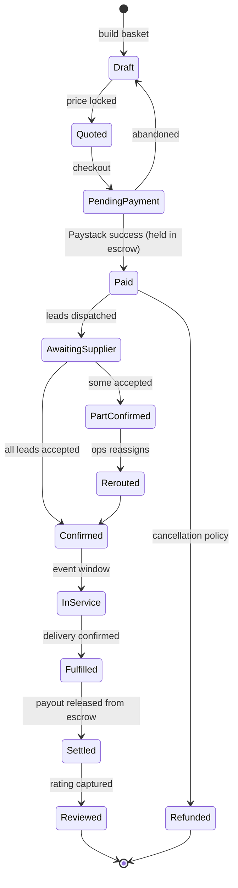

### 7.3 Change-request ticket — state machine (headcount / material scope)

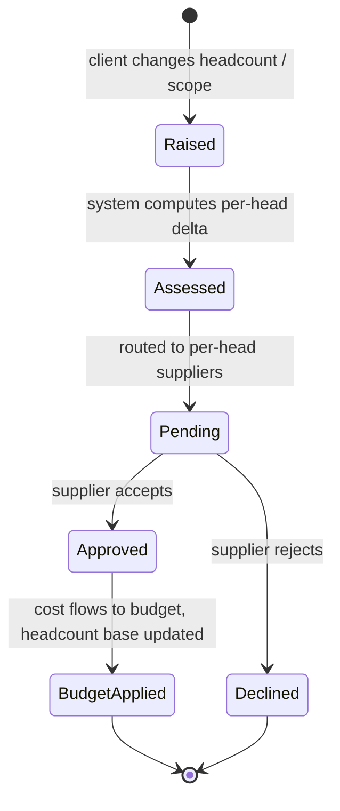

### 7.4 Support / dispute ticket — state machine

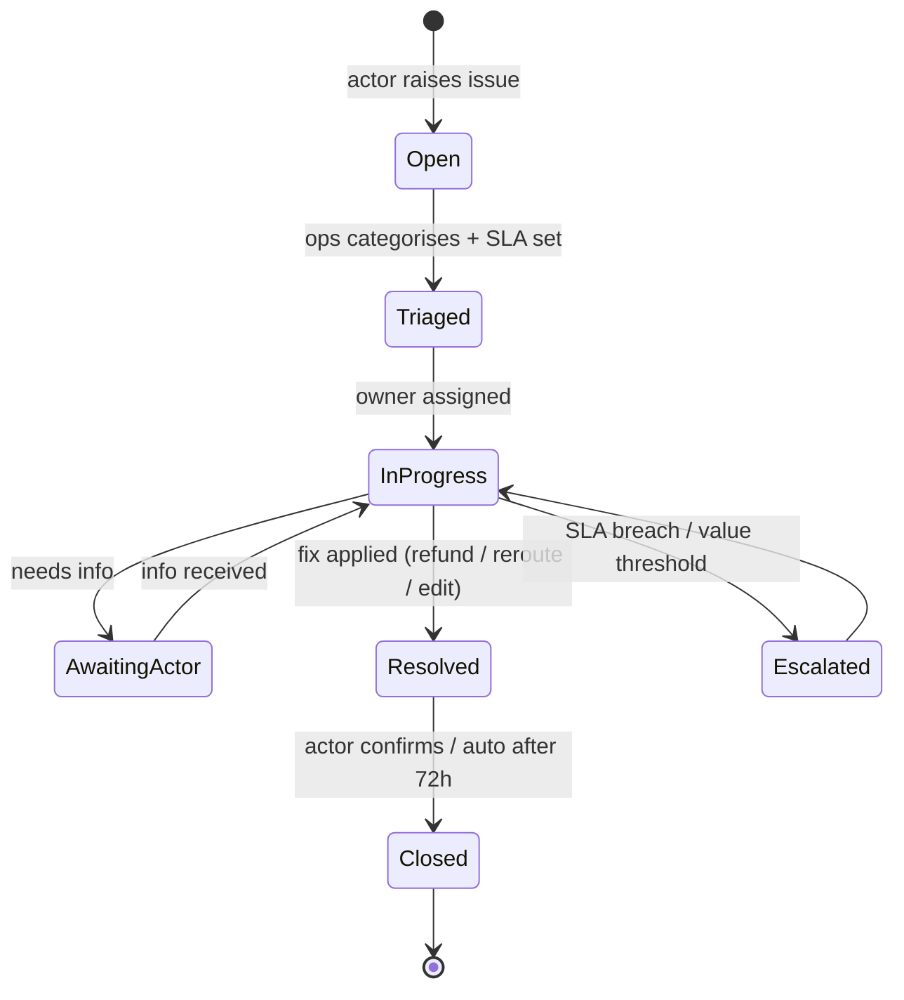

### 7.5 Audit log (traceability guarantee)

Every state transition writes one immutable row. A single query on `ref` returns the full life of any ticket.

| Field | Example |
|---|---|
| `ref` | `ST-BKG-00042` |
| `entity_type` | `booking` |
| `actor_id` / `actor_role` | `u_112` / `client` |
| `from_state` → `to_state` | `Paid` → `AwaitingSupplier` |
| `event` | `LeadsDispatched` |
| `payload` | `{ leads: [ST-LEAD-071, ST-LEAD-072] }` |
| `at` | `2026-08-07T14:04:22+02:00` |

**SLA & ownership:** each ticket type has a target response (leads 2h, change-requests 24h, disputes 4h triage) and an explicit owner at every state — so "who's holding this and since when" is always answerable.

---

## 8. End-to-end workflows (sequence diagrams)

Each workflow shows a clear **start and end for every actor**.

### 8.1 Client onboarding → wedding created
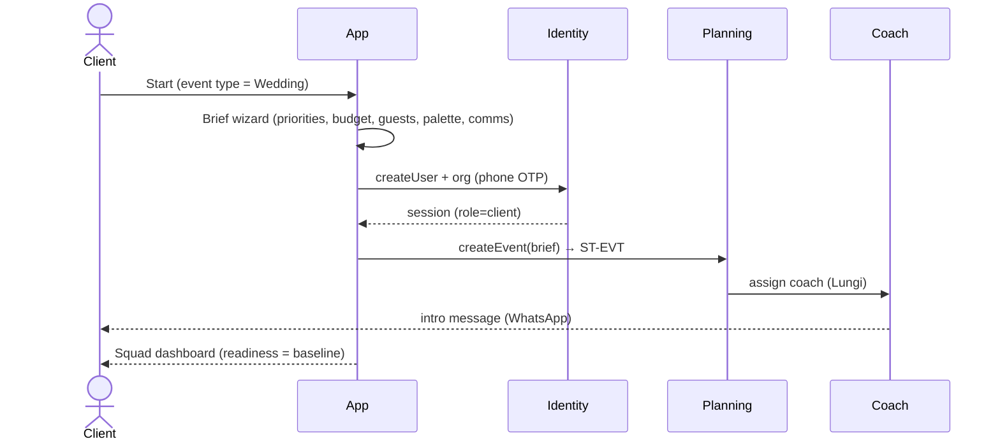

### 8.2 Quote → book → pay (escrow) → supplier lead  — the money path
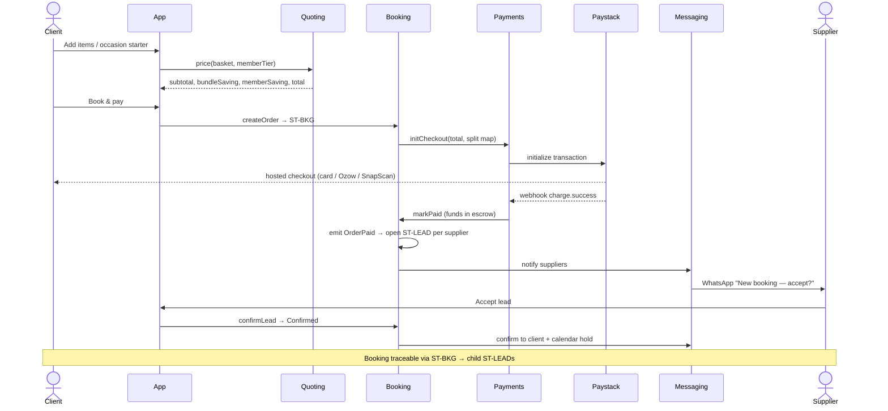

### 8.3 On-demand Stitch It hire (walk-in, fast)
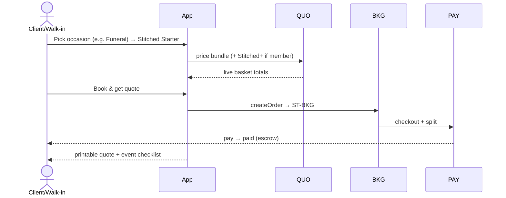

### 8.4 Headcount change → per-head budget → supplier approval
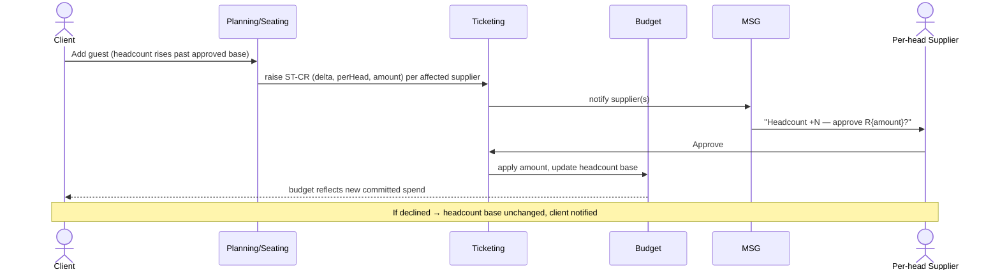

### 8.5 Supplier Boost → ranking → client conversion (upsell loop)
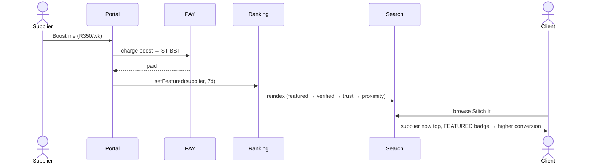

### 8.6 Stitched+ subscription (recurring)
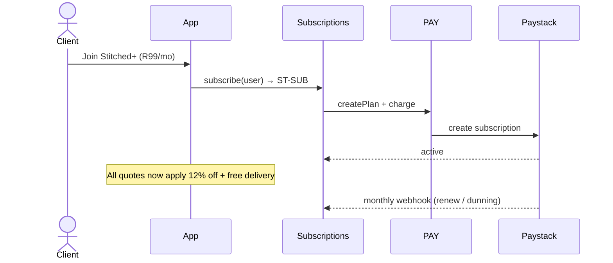

### 8.7 Fulfilment → payout release (escrow settle)
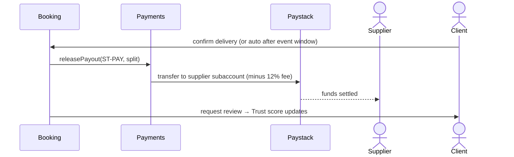

### 8.8 Support / dispute
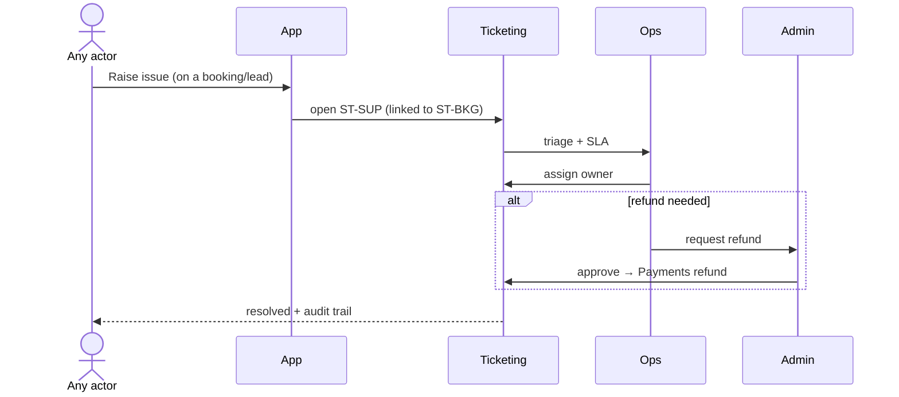

### 8.9 Funeral journey (intuition: same engine, compressed)
```mermaid
sequenceDiagram
    actor U as Family member
    participant App
    participant QUO
    participant BKG
    participant MSG
    U->>App: Stitch It → occasion = Funeral
    App-->>U: dignified template, rapid starter (marquee, seating, catering, PA)
    U->>QUO: adjust numbers
    U->>BKG: book (expedited availability filter = 48h)
    BKG->>MSG: priority supplier alerts
    Note over U: Same ticketing/traceability; timeline compressed to days
```

---

## 9. Payments integration module (the plug-in) — closing the MVP gap

> The MVP simulates payment. Production needs a real, **real-time**, swappable gateway module. This is the single most important integration to build correctly.

### 9.1 Design goals
- **Adapter pattern** — a `PaymentProvider` interface so Paystack can be swapped/augmented (Ozow, Stripe, Yoco) without touching Booking.
- **Escrow model** — client funds held, released to suppliers only on fulfilment (protects both sides; core to trust).
- **Split payouts** — one client payment fans out to N suppliers minus the 12% platform fee.
- **Idempotent + webhook-driven** — status is truth from Paystack webhooks, never from the client.
- **Real-time status** — payment/lead state pushed to UI over the real-time bus (§10).

### 9.2 Provider interface (contract)
```ts
interface PaymentProvider {
  initCheckout(input: {
    orderRef: string;              // ST-BKG-####
    amountZarCents: number;
    customer: { email?: string; phone: string };
    split: Array<{ supplierSubaccount: string; shareCents: number }>;
    platformFeeCents: number;
    metadata: Record<string,string>;
    idempotencyKey: string;
  }): Promise<{ checkoutUrl: string; providerRef: string }>;

  createSubscription(input: {
    planCode: string; customer: {...}; subRef: string;  // ST-SUB-####
  }): Promise<{ providerRef: string; status: 'active'|'pending' }>;

  chargeBoost(input: {
    supplierId: string; amountZarCents: number; boostRef: string;  // ST-BST-####
  }): Promise<{ providerRef: string; status: 'paid'|'failed' }>;

  releasePayout(input: {
    payoutRef: string;             // ST-PAY-####
    supplierSubaccount: string; amountZarCents: number;
  }): Promise<{ transferRef: string; status: 'queued'|'settled' }>;

  refund(input: { orderRef: string; amountZarCents: number; reason: string })
    : Promise<{ refundRef: string; status: 'processing'|'refunded' }>;

  verifyWebhook(rawBody: string, signature: string): boolean; // HMAC
  parseEvent(rawBody: string): PaymentEvent;
}
```

### 9.3 Paystack mapping
| STITCHD concept | Paystack primitive |
|---|---|
| Client checkout | Transaction Initialize (channels: card, bank, ussd, ozow, snapscan) |
| Split to suppliers | Split Payments / Subaccounts + `transaction_split` |
| Platform fee | `bearer=account`, fixed/percentage split |
| Escrow hold | Delay payout: settle to platform, release via Transfer on fulfilment |
| Supplier payout | Transfers API → supplier subaccount |
| Stitched+ | Plans + Subscriptions |
| Boost | One-off Transaction |
| Refund | Refund API |
| Truth source | Webhooks: `charge.success`, `transfer.success`, `subscription.*`, `refund.processed` |

### 9.4 Webhook handling (idempotent)
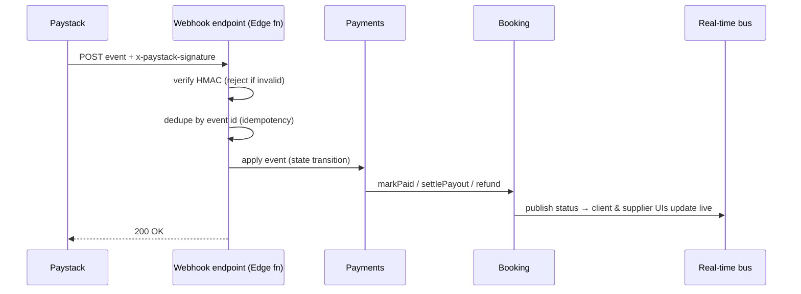

### 9.5 Non-negotiables
- Verify every webhook HMAC; store `provider_event_id` unique to guarantee **exactly-once**.
- Never trust client-reported success; UI shows "pending" until webhook confirms.
- All money in **integer ZAR cents**; no floats.
- Full PCI scope avoided — card data only ever on Paystack-hosted checkout.
- Every payment action writes an `ST-PAY` / `ST-BKG` audit row (§7.5).
- Reconciliation job (pg_boss, nightly): match provider settlements to `payments` ledger; flag deltas as `ST-SUP` tickets.

---

## 10. Real-time module

- **Transport:** Supabase Realtime (Postgres logical replication → websockets). No extra infra.
- **Channels:** `event:{eventId}` (planning), `supplier:{supplierId}` (leads/earnings), `ops:leadboard` (all leads), `booking:{ref}` (payment status).
- **Events pushed:** `LeadCreated`, `LeadAccepted`, `PaymentConfirmed`, `HeadcountChangeRaised`, `ChangeApproved`, `BoostActivated`, `MessagePosted`, `PayoutSettled`.
- **UX effect:** supplier lead inbox, ops lead board, chat, headcount approvals and payment status all update **without refresh**.
- **Fallback:** if socket drops, poll last-event cursor; reconcile.

---

## 11. Messaging module

- **Primary:** WhatsApp Cloud API (Meta) — the SA default channel.
- **Fallback:** Clickatell SMS; email via transactional provider.
- **Templated flows:** lead alert, lead accepted, RSVP invite + reminder, headcount approval request, payment receipt, payout notice, review request.
- **Deep links:** RSVP link (no login), supplier accept link, pay link — each carries a signed token bound to a ticket ref.
- **Compliance:** opt-in tracked; STOP handling; message log linked to the relevant `ST-*` ref for traceability.
---

## 12. Data model (ERD)

Core entities. All money in integer **ZAR cents**. All tables carry `org_id` for RLS, `created_at`, `updated_at`. Append-only `activity_log` is the audit spine (§7.5).

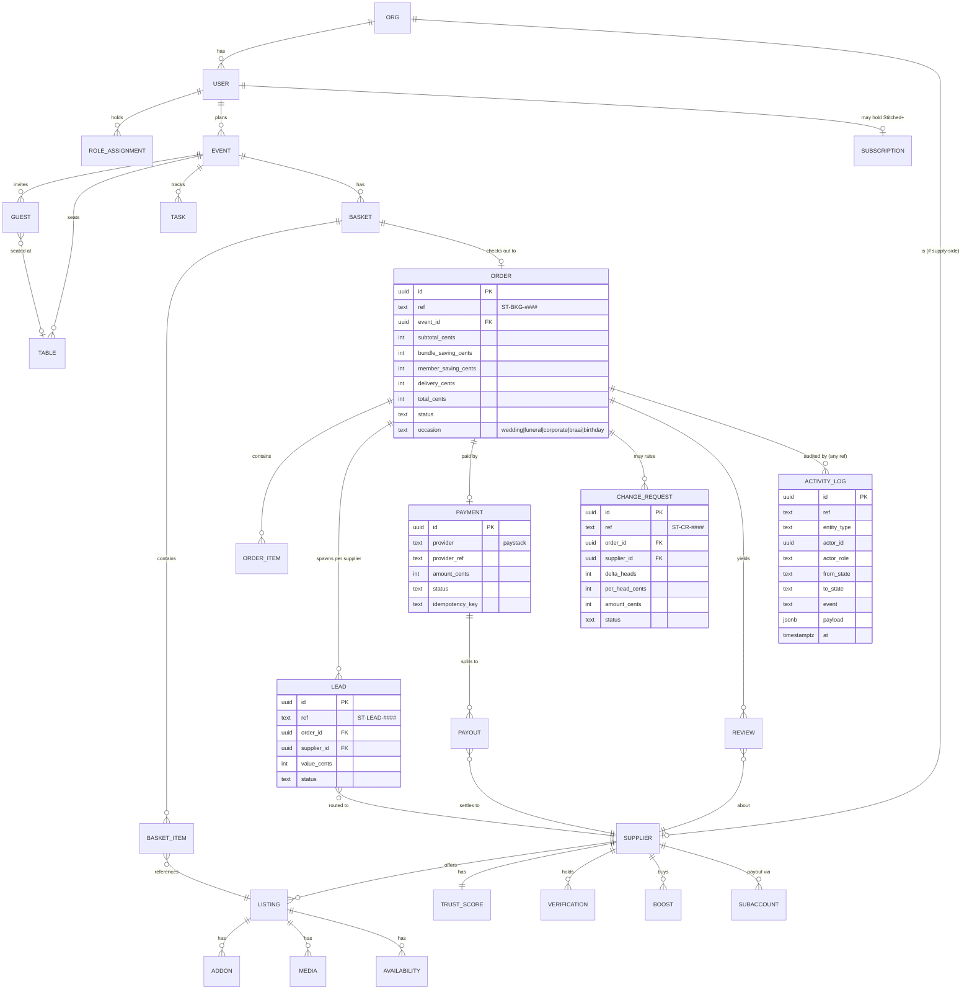

**Notes for the developer.** `activity_log` is written inside the same transaction as every state change (transactional outbox), so the audit trail can never drift from reality. `ref` sequences are generated per-type from Postgres sequences. `SUBACCOUNT` maps a supplier to their Paystack subaccount for split payouts.

---

## 13. API design — API-first, event-driven, real-time-testable

> **Founder requirement:** the whole system must be **API-driven and testable via API tools** (REST clients, GraphQL/graph explorers, Python). No batch jobs on the request path — everything is **synchronous API + asynchronous events**. This section is the contract a "seasoned tester" uses.

### 13.1 API surfaces (three, all real)
1. **Auto-generated REST** — Supabase **PostgREST** exposes every table/view as REST instantly, guarded by RLS. Great for CRUD + tester exploration.
2. **Auto-generated GraphQL** — Supabase **`pg_graphql`** exposes a `/graphql/v1` endpoint over the same schema/RLS. This is the "**graph tool**" surface: point Apollo Sandbox / GraphiQL / Insomnia at it and traverse the graph (order → leads → supplier → payout) in one query.
3. **Custom domain API (Edge Functions)** — hand-written endpoints for anything with side-effects or money (checkout, webhooks, boost, approvals). REST/JSON, versioned under `/api/v1/*`, documented by an **OpenAPI 3.1** spec (`openapi.yaml`) so Postman/Bruno/Swagger import it directly.

> Rule of thumb: **reads** via PostGREST/GraphQL (RLS-safe), **writes with side-effects** via `/api/v1/*` Edge Functions (validation, events, idempotency).

### 13.2 Auth & tenancy
- **Auth:** Supabase Auth — email OTP + **phone/WhatsApp OTP** (phone-first for SA). JWT bearer on every call.
- **RBAC:** role claims in JWT (`client|supplier|coach|ops|admin|super`); **RLS** policies enforce row scope by `org_id`/`user_id`/`role`.
- **Service role key** (server-only) bypasses RLS for Edge Functions and webhooks — never shipped to the client.
- **Testing identities:** seeded users per role (§16) with a `/api/v1/auth/test-token` endpoint (sandbox only, behind a flag) that mints a scoped JWT so testers can exercise each role without OTP.

### 13.3 Custom domain endpoints (`/api/v1`) — the side-effect API

| Method & path | Purpose | Emits event | Idempotent |
|---|---|---|---|
| `POST /api/v1/events` | Create an event (wedding/funeral…) from brief | `EventCreated` | key |
| `POST /api/v1/baskets/:id/price` | Price a basket (bundles, Stitched+) | — | ✓ pure |
| `POST /api/v1/orders` | Check out a basket → order (Draft→Quoted) | `OrderCreated` | key |
| `POST /api/v1/orders/:ref/checkout` | Init Paystack checkout | `CheckoutInitiated` | key |
| `POST /api/v1/webhooks/paystack` | Payment truth (HMAC-verified) | `PaymentConfirmed`/… | provider id |
| `POST /api/v1/leads/:ref/accept` | Supplier accepts a lead | `LeadAccepted` | key |
| `POST /api/v1/leads/:ref/decline` | Supplier passes | `LeadDeclined` | key |
| `POST /api/v1/leads/:ref/reroute` | Ops reassigns | `LeadRerouted` | key |
| `POST /api/v1/change-requests` | Raise headcount/scope change | `HeadcountChangeRaised` | key |
| `POST /api/v1/change-requests/:ref/approve` | Supplier approves (per-head) | `ChangeApproved` | key |
| `POST /api/v1/change-requests/:ref/decline` | Supplier declines | `ChangeDeclined` | key |
| `POST /api/v1/boosts` | Buy Boost (charges + features) | `BoostActivated` | key |
| `POST /api/v1/verifications/:supplierId` | Admin verify supplier | `SupplierVerified` | key |
| `POST /api/v1/subscriptions` | Join Stitched+ | `SubscriptionActivated` | key |
| `POST /api/v1/payouts/:ref/release` | Release escrow to supplier | `PayoutReleased` | key |
| `POST /api/v1/tickets` | Open support/dispute | `TicketOpened` | key |
| `POST /api/v1/rsvp/:token` | Guest RSVP (no login, signed token) | `RsvpSubmitted` | token |
| `GET  /api/v1/tickets/:ref/trace` | **Full audit trail for any ref** | — | ✓ |

All mutating endpoints accept an `Idempotency-Key` header and return the resulting entity + its new state. Errors use RFC-7807 problem+json with stable `code`s (§Appendix).

### 13.4 Read surface (PostgREST + GraphQL) — examples

REST (RLS-scoped):
```
GET /rest/v1/orders?ref=eq.ST-BKG-00042&select=*,leads(*),payment(*),change_requests(*)
GET /rest/v1/leads?status=eq.new&supplier_id=eq.<uuid>&order=created_at.desc
GET /rest/v1/listings?category=eq.marquee&select=*,supplier(name,area,verified,trust_score)
```

GraphQL (same data, graph traversal — the "graph tool" surface):
```graphql
query TraceBooking($ref: String!) {
  ordersCollection(filter: { ref: { eq: $ref } }) {
    edges { node {
      ref status total_cents occasion
      leadsCollection { edges { node { ref status supplier { name area } } } }
      payment { provider_ref status amount_cents }
      change_requestsCollection { edges { node { ref delta_heads amount_cents status } } }
    } }
  }
}
```

### 13.5 Real-time subscriptions (no polling, event-driven)
```js
// Supplier lead inbox updates live — no refresh, no batch
supabase.channel('supplier:{id}')
  .on('postgres_changes',
      { event: 'INSERT', schema: 'public', table: 'leads', filter: 'supplier_id=eq.{id}' },
      payload => addLeadToInbox(payload.new))
  .subscribe();
```
Channels: `event:{id}`, `supplier:{id}`, `ops:leadboard`, `booking:{ref}`, `ticket:{ref}`.

---

## 14. Event catalog (the async backbone)

Events are the contract between modules and the fuel for real-time. Each is emitted transactionally (outbox) and delivered via Supabase Realtime + pg_boss workers. **No business step waits on a batch.**

| Event | Emitted by | Consumed by | Effect |
|---|---|---|---|
| `EventCreated` | Planning | Catalog, Coach | seed squad slots, assign coach |
| `OrderCreated` | Booking | Payments | prepare checkout |
| `CheckoutInitiated` | Payments | — (client) | return Paystack URL |
| `PaymentConfirmed` | Payments (webhook) | Booking, Messaging, Ledger | mark paid (escrow), dispatch leads, receipt |
| `LeadsDispatched` | Booking | Messaging, Supplier UIs | WhatsApp alerts, inbox rows |
| `LeadAccepted` / `LeadDeclined` | Booking | Booking, Ops, Client UI | progress order; reroute if declined |
| `HeadcountChangeRaised` | Planning | Booking, Supplier UIs | create per-head change tickets |
| `ChangeApproved` / `ChangeDeclined` | Booking | Budget, Client UI | apply cost, update headcount base |
| `BoostActivated` | Ranking | Search/Catalog | re-rank; FEATURED badge live |
| `SupplierVerified` | Trust | Catalog | VERIFIED badge; conversion lift |
| `SubscriptionActivated` | Subscriptions | Quoting | member pricing everywhere |
| `Fulfilled` | Booking | Payments | release payout from escrow |
| `PayoutReleased`/`PayoutSettled` | Payments | Supplier UI, Ledger | earnings + notice |
| `ReviewCreated` | Reviews | Trust, Ranking | recompute Trust score |
| `TicketOpened`/`TicketResolved` | Ticketing | Ops, actor | SLA clock, notify |

Every event also appends to `activity_log`, guaranteeing traceability (§7.5).

---

## 15. API testing harness (for a seasoned tester)

The founder wants to hand a tester something they can **run against the APIs** on day one. Deliverables:

### 15.1 What ships in the repo
- `openapi.yaml` — the full `/api/v1` contract (import into Postman/Bruno/Swagger UI).
- `postman/STITCHD.postman_collection.json` — every endpoint with example bodies + env (`{{baseUrl}}`, `{{jwt}}`).
- `graphql/` — saved GraphQL queries + a link to the hosted **GraphiQL/Apollo Sandbox**.
- `tests/` — a **pytest** suite (below) that walks a full booking lifecycle against the sandbox.
- A seeded **sandbox environment** with test users, Paystack **test keys**, and WhatsApp sandbox numbers.

### 15.2 Python smoke test — full money path (illustrative)
```python
import requests, uuid
BASE = "https://sandbox.stitchd.co.za"

def tok(role):  # sandbox-only helper endpoint mints a scoped JWT
    return requests.post(f"{BASE}/api/v1/auth/test-token", json={"role": role}).json()["jwt"]

client = {"Authorization": f"Bearer {tok('client')}"}
supplier = {"Authorization": f"Bearer {tok('supplier')}"}

# 1) price a basket
basket = requests.post(f"{BASE}/api/v1/baskets/BKT-DEMO/price",
                       json={"items":[{"listing":"h1","qty":1}], "member": False},
                       headers=client).json()
assert basket["total_cents"] > 0

# 2) create order + checkout (idempotent)
key = str(uuid.uuid4())
order = requests.post(f"{BASE}/api/v1/orders",
                      json={"basket":"BKT-DEMO"},
                      headers={**client, "Idempotency-Key": key}).json()
checkout = requests.post(f"{BASE}/api/v1/orders/{order['ref']}/checkout",
                         headers={**client, "Idempotency-Key": key}).json()
assert checkout["checkout_url"].startswith("https://")

# 3) simulate Paystack webhook (sandbox accepts test-signed events)
requests.post(f"{BASE}/api/v1/webhooks/paystack",
              data=open("tests/fixtures/charge_success.json","rb").read(),
              headers={"x-paystack-signature": "<test-hmac>"})

# 4) supplier accepts the spawned lead
leads = requests.get(f"{BASE}/rest/v1/leads?order_id=eq.{order['id']}", headers=supplier).json()
requests.post(f"{BASE}/api/v1/leads/{leads[0]['ref']}/accept", headers=supplier)

# 5) trace the whole ticket end-to-end
trace = requests.get(f"{BASE}/api/v1/tickets/{order['ref']}/trace", headers=client).json()
assert trace[0]["to_state"] == "Draft" and trace[-1]["to_state"] in ("AwaitingSupplier","Confirmed")
print("PASS — full lifecycle traced:", [t["to_state"] for t in trace])
```

### 15.3 Test matrix (contract-level)
| Area | Cases |
|---|---|
| Auth/RBAC | each role can/can't hit each endpoint (RLS + 403s) |
| Idempotency | same `Idempotency-Key` → one effect |
| Payments | webhook HMAC valid/invalid; exactly-once; refund; split totals |
| Change flow | headcount delta → per-head amount → approve → budget applied |
| Ranking | boost → order changes; verify → badge |
| Real-time | subscribe → mutate → event received < 1s |
| Traceability | `/trace` returns contiguous state history |

---

## 16. Design tokens (exact, normative)

```jsonc
{
  "font": { "brand": "Archivo Black", "display": "Fraunces", "ui": "Manrope" },
  "dark": {
    "bg": "#0A0A0E", "panel": "#131319", "panel2": "#1A1A23",
    "ink": "#F2F0EC", "sub": "#9C99AB", "faint": "#5E5B6E",
    "good": "#3DD68C", "warn": "#E9B84C", "bad": "#F0644C", "info": "#5FA8F5"
  },
  "light": {
    "bg": "#F3F1ED", "panel": "#FCFBF8", "panel2": "#ECEAE4",
    "ink": "#171522", "sub": "#5D5A6E", "faint": "#96939F",
    "good": "#178A57", "warn": "#A97614", "bad": "#C24B33", "info": "#2A6BB0"
  },
  "palettes": {
    "midnightViolet":   ["#4B3F8F","#8B7AF5","#221B3A","#E7E3F5","#D4A94E"],
    "blushRomance":     ["#E8C7C8","#C98B95","#8A5A66","#F3E9E4","#D4A94E"],
    "emeraldGold":      ["#1E6E52","#3DA57A","#0E3B2C","#E9E2D0","#D4A94E"],
    "terracottaSunset": ["#B5613C","#E0824F","#7A3B22","#F2E4D6","#C9A24B"],
    "sageGarden":       ["#7A8A5A","#A7B588","#4E5B3A","#EDEFE3","#C9A24B"],
    "royalNavy":        ["#25365A","#43618E","#141E33","#E4E8EF","#D4A94E"],
    "dustyRose":        ["#C48B94","#E3B7BE","#8A5560","#F4E9EB","#B99B54"],
    "goldenHour":       ["#D99B4C","#F0C378","#9A6522","#F6ECD9","#8A6A2A"],
    "traditionalAfrican":["#C1272D","#E8A020","#1E7A3C","#F3E7CE","#111111"]
  },
  "motion": { "press": "0.12s", "rise": "0.5s cubic-bezier(.16,1,.3,1)", "reducedMotion": "honoured" },
  "radius": { "card": 16, "chip": 999 }
}
```
Palette selection sets `accent`, `gold`, and the **background wash** (`deep` in dark / `cream` in light) and rewrites palette-bound supplier briefs (florals, décor, linen, cake, tailoring).

---

## 17. Non-functional requirements

| Area | Requirement |
|---|---|
| **Performance** | p95 API < 300ms (reads), < 800ms (checkout init); real-time delivery < 1s |
| **Availability** | 99.5% pitch target; managed tiers; daily PITR backups |
| **Security** | JWT + RLS on every row; service key server-only; HMAC-verified webhooks; signed URLs for private docs; secrets in vault; least-privilege roles |
| **Payments** | PCI scope minimised (hosted checkout); money in integer cents; idempotent + exactly-once; reconciliation nightly |
| **POPIA** | RLS isolation; PII minimisation; consent tracking; data-subject **export & erase** jobs; processor agreements; region portable to `af-south-1` |
| **Observability** | structured logs, Sentry errors/traces, event log = business audit; per-ticket SLA dashboards |
| **Accessibility** | focus-visible, reduced-motion, contrast AA, keyboard paths |
| **Cost** | < R800/month pre-revenue on free/managed tiers |

---

## 18. Delivery plan & build-ticket management

### 18.1 How build tickets are managed
Work is tracked as **Epics → Stories → Tasks** in the tracker (Linear/Jira), one epic per bounded context. Definition of Done for every story: code + tests (unit + API contract) + RLS policy + OpenAPI updated + event emitted + audit row + demo on the sandbox. Branch per story, PR review, CI runs the pytest API suite (§15) before merge. Trace IDs in the app (`ST-*`) mirror ticket refs so a support issue links to the exact order.

### 18.2 This-week build order (pitch build)
| Day | Deliverable | Modules |
|---|---|---|
| Mon | Repo, Supabase, Auth (phone OTP), schema + RLS, `ST-*` sequences, OpenAPI skeleton | Identity, Catalog |
| Tue | Catalog + Listings + media (R2); port MVP UI to live REST/GraphQL | Catalog, Availability |
| Wed | Quoting (bundles, Stitched+) + Order + **Paystack checkout** (test) + webhook | Quoting, Booking, Payments |
| Thu | Supplier Portal live: leads (Realtime), accept/decline, **Boost + Verify → ranking**; change-request/approval flow | Booking, Ranking, Trust, Ticketing |
| Fri | WhatsApp lead alerts + RSVP; Stitched+ subscribe; seed Junior & Nadine + 20 Joburg suppliers; deploy sandbox + Postman/pytest | Messaging, Subs |
| Wknd | Hardening: RLS matrix, webhook exactly-once, printable docs, Sentry, dispute/refund | All |

**Pitch "done":** a client builds a Stitch It quote, subscribes to Stitched+, pays via Paystack (test), a real supplier gets a WhatsApp lead and accepts it in the portal, Boost/Verify visibly re-rank the client grid, a headcount change routes for per-head approval and flows to budget — and every step is traceable via `/trace`, runnable from Postman/pytest.

---

## 19. Seed / dummy data — the flagship demo

### 19.1 The couple
> **Junior & Nadine Chaka** — Black South African couple. Wedding **14 Nov 2026**, **Oakfield Farm, Muldersdrift**, **140 guests**, budget **R400k**, palette **Traditional African** (switchable), coach **Lungi Dlodlo (VIP Hosting)**. *Real couple photos supplied by founder; until then a placeholder Black-representation portrait is used and clearly swappable via one media reference.*

### 19.2 Suppliers (Joburg, simulated)
Squad: VIP Hosting (planner), Oakfield Farm (venue, multi-service bundle), Memories by TK (photo), Taste Affair (catering, per-head), Bloom Room (flowers), Vibe Creators (DJ), Sugar & Spice (cake), Stitch & Cut Atelier (tailor), Décor Elegance, Shade & Shine Marquees, Glam Squad by Zanele, VIP Chauffeurs.
Stitch It: Stretch & Shade (Fourways), BassLine JHB (Soweto), Braai Brothers (Randburg), Bounce Town (Boksburg), Tap & Pour (Sandton), Loo Deluxe (Kempton Park), Bean Machine (Parktown), Chill Trailer Co (Edenvale), Snap Shack (Rosebank) …

### 19.3 Seed tickets (so `/trace` demos immediately)
- `ST-BKG-00042` — Chaka wedding catering+DJ+décor bundle, `AwaitingSupplier`.
- `ST-CR-00007` — +6 guests → Taste Affair per-head change, `Pending`.
- `ST-BST-00003` — Snap Shack boost, `Active`.
- `ST-SUB-00011` — Chaka Stitched+, `Active`.

### 19.4 Seed users (one per role, for API tests)
`client@demo`, `supplier@demo`, `coach@demo`, `ops@demo`, `admin@demo`, `super@demo` — each mintable via the sandbox test-token endpoint (§13.2).

---

## 20. Roadmap (post-pitch)

| Phase | Focus |
|---|---|
| **P1 (now)** | Weddings live; on-demand + funeral visible; payments, portal, real-time, traceability |
| **P1.5** | Funeral fast-track templates; corporate presets; supplier mobile PWA polish |
| **P2** | Typesense search; ML ranking; multi-city; loyalty; insurance/finance add-ons |
| **P3** | `af-south-1` residency; KAZI Trust-Passport interop; AI concierge |

---

## Appendix A — Error codes (problem+json)
`AUTH_401`, `RBAC_403`, `IDEMPOTENCY_CONFLICT_409`, `PAYMENT_WEBHOOK_INVALID_400`, `LEAD_ALREADY_RESOLVED_409`, `CHANGE_ALREADY_RESOLVED_409`, `INSUFFICIENT_AVAILABILITY_409`, `VALIDATION_422`, `RATE_LIMIT_429`.

## Appendix B — Key environment variables
`SUPABASE_URL`, `SUPABASE_ANON_KEY`, `SUPABASE_SERVICE_ROLE_KEY`, `PAYSTACK_SECRET_KEY`, `PAYSTACK_PUBLIC_KEY`, `PAYSTACK_WEBHOOK_SECRET`, `WHATSAPP_TOKEN`, `WHATSAPP_PHONE_ID`, `CLICKATELL_API_KEY`, `R2_ACCESS_KEY`, `R2_SECRET`, `JWT_SECRET`, `SANDBOX_TEST_TOKENS=on|off`.

## Appendix C — Glossary
**Lens** = a client screen/mode. **Ticket** = any trackable entity (`ST-*`). **Squad** = the set of suppliers for an event. **Stitch It** = on-demand marketplace. **Stitched+** = client subscription. **Boost** = paid featured placement. **Trust score** = supplier reputation index feeding ranking.

---

*End of specification. Everything in the reference MVP (`stitchd-v9`) maps to a module, an API, an event and a ticket type here — nothing shown in the demo is throwaway, and every actor has a defined start and end for every process.*
